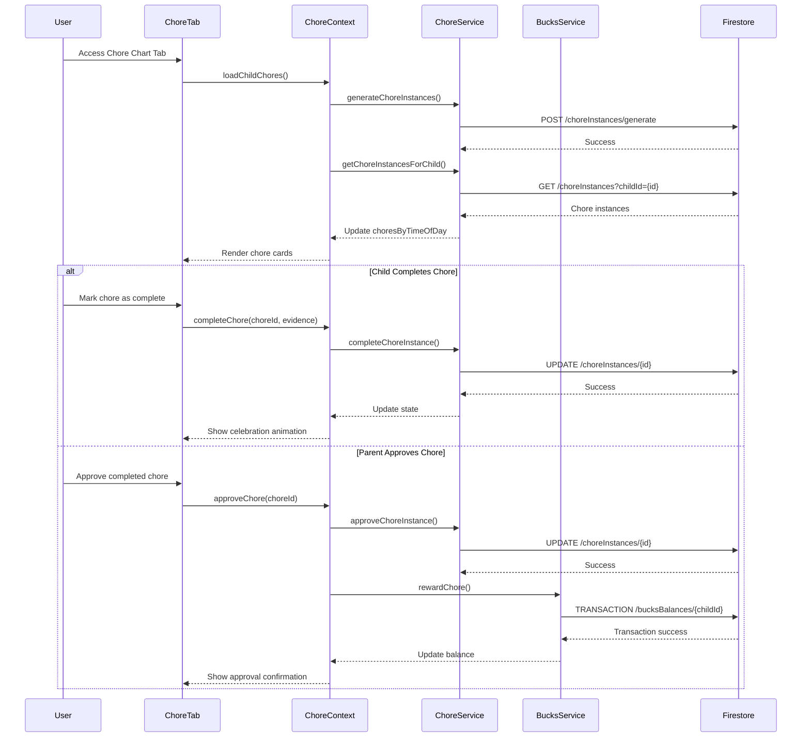

# Chore Chart Tab

## What this tab is for
The Chore Chart tab presents users with their assigned household chores and tasks organized by time of day. For parents, it displays all family chores with oversight capabilities and approval options. For children, it provides a personalized view of their assigned chores with completion tracking, reward information, and fun celebration animations when tasks are completed. The interface is designed to encourage responsibility and task completion through visual progress tracking and immediate reward feedback.

## Key React pieces
| Component / Hook | File path | One-line responsibility |
|------------------|-----------|-------------------------|
| ChoreTab | src/components/dashboard/tabs/chore/ChoreTab.jsx | Main container displaying the user's chore assignments and interface |
| SpotifyChoreCard | src/components/chore/SpotifyChoreCard.jsx | Visual card showing details for a single chore assignment |
| ChoreCompletionModal | src/components/chore/ChoreCompletionModal.jsx | Interface for marking chores complete with photo evidence options |
| BucksBalanceDisplay | src/components/bucks/BucksBalanceDisplay.jsx | Shows current Palsson Bucks balance and recent transactions |
| CelebrationAnimation | src/components/dashboard/tabs/chore/ChoreTab.jsx | Provides visual celebration effects when chores are completed |
| useChore | src/contexts/ChoreContext.js | Custom hook for accessing and managing chore-related data |
| ChoreService | src/services/ChoreService.js | Backend service for chore data operations |

## Core data & API calls
* ChoreContext provider for chore-related state management
* FamilyContext provider for family member information
* ChoreService for retrieving and updating chore instances
* BucksService for managing currency earned from chores
* Firebase Firestore operations for chore data
* Chore instances organized by time of day (morning, afternoon, evening)
* Parent approval workflow for child-completed chores
* Celebration animations and feedback system

## Current Feature Flags & Env Vars
| Flag / Var | Default | Description | Doc link |
|------------|---------|-------------|----------|
| None specific to this tab | - | - | - |

## Glossary
* **Chore Instance** - Specific assignment of a chore to a child with due date and status
* **Time of Day** - Organizational category for chores (morning, afternoon, evening, anytime)
* **Completion Evidence** - Photo or description proving a chore was completed
* **Palsson Bucks** - Virtual currency earned by completing chores
* **Streak** - Consecutive days a recurring chore has been completed
* **Difficulty Level** - Rating affecting point value and complexity of a chore
* **Approval Status** - Current state of a completed chore (pending, approved, rejected)

## Recent changes *(auto-generated)*
```
7a7b746 Sun May 18 16:21:13 2025 +0200 Updated code
```

## Dev commands & storybook entries
* Run the app: `npm start` then navigate to the Chore Chart tab
* Test chore functionality: `npm run test -- --testPathPattern=ChoreTab`
* View chore components in isolation: `npm run storybook` then navigate to Chore section
* Storybook entries:
  * `SpotifyChoreCard.stories.jsx`
  * `ChoreCompletionFlow.stories.jsx`
  * `CelebrationEffects.stories.jsx`
* Cypress specs: `cypress/integration/chores/chore_completion.spec.js`

## How the entire tab works end-to-end

### User Journey
1. User accesses Dashboard → Chore Chart tab
2. System renders child-specific or parent-overview interface based on user role
3. Chores are displayed in time-of-day sections (morning, afternoon, evening, anytime)
4. For children: Can view assigned chores, mark them complete with evidence, and see earned rewards
5. For parents: Can view all family chores, approve completed chores, and adjust assignments
6. Chore completion triggers celebration animation and Palsson Bucks award if approved

### State & Data Flow
- **Context Providers**: Uses `ChoreContext` and `FamilyContext` for state management
- **Hooks**: `useChore()` provides chore-related functions and state
- **State Flow**:
  - Initial load: `ChoreProvider` generates daily chore instances from templates via `generateChoreInstances()`
  - Chore display: Organizes chores by time of day with `choresByTimeOfDay` state
  - Completion flow: Child completes chore → updates status → triggers pending approval
  - Approval flow: Parent approves chore → triggers Bucks award → updates status

### API Sequence
1. **Generate Daily Chores**: `POST /choreInstances/generate` - Creates instances from templates for today
2. **Load Child Chores**: `GET /choreInstances?childId={id}` - Retrieves assigned chores for child
3. **Load Family Chores**: `GET /choreInstances?familyId={id}` - Retrieves all family chores (parent view)
4. **Complete Chore**: `UPDATE /choreInstances/{id}` - Marks chore as completed with evidence
5. **Upload Evidence**: `PUT /storage/choreEvidence/{id}` - Uploads photo evidence if provided
6. **Approve Chore**: `UPDATE /choreInstances/{id}` - Parent approves completed chore
7. **Award Bucks**: `TRANSACTION /bucksBalances/{childId}` - Awards Palsson Bucks for completion
8. **Reject Chore**: `UPDATE /choreInstances/{id}` - Parent rejects with reason for improvements

### Side-effects & Cross-tab Links
- **Bucks System**: Successful chore completion triggers Bucks rewards via `BucksService.rewardChore()`
- **Notifications**: Generates alerts for chore assignments, due dates, and approvals
- **Calendar Integration**: Adds completed chores to family calendar for tracking
- **Knowledge Graph**: Updates behavior patterns and responsibility metrics
- **Task Sequences**: May trigger next steps in multi-step family processes

### Failure & Edge Cases
- **Evidence Upload Failure**: Provides retry mechanism and alternative text submission
- **Network Offline**: Caches completion data for sync when connection is restored
- **Late Completion**: Handles past-due chores with different visual indicators
- **Duplicate Completions**: Prevents multiple submissions for the same chore instance
- **Approval Conflict**: Handles cases where multiple parents try to approve the same chore

### Mermaid Sequence Diagram


## Open TODOs / tech-debt
- [ ] Add drag-and-drop priority reordering for chores
- [ ] Implement voice recording for completion evidence
- [ ] Add time tracking for chore duration
- [ ] Improve offline support for chore completion
- [ ] Add accessibility improvements for celebration animations