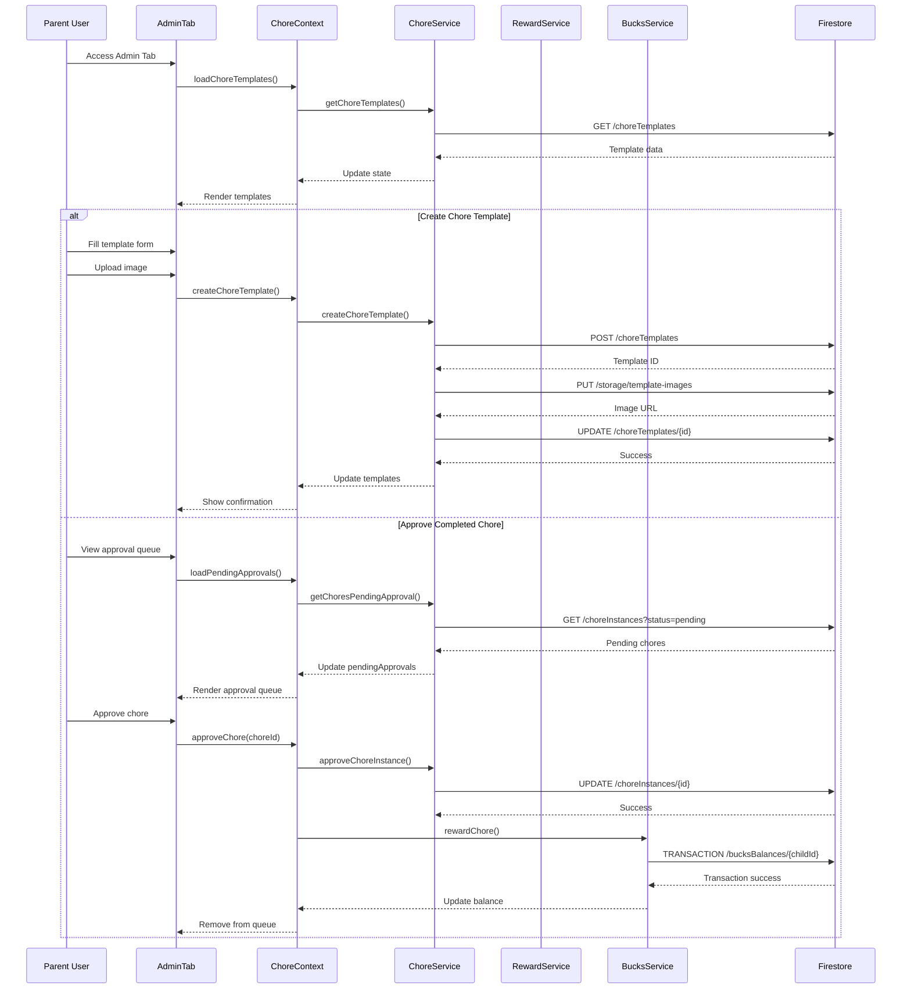

# Chore & Reward Admin Tab

## What this tab is for
The Chore & Reward Admin tab provides parents with comprehensive management tools for the family's chore system and reward marketplace. This tab is exclusively available to parent accounts and offers interfaces for creating, editing, and managing chore templates, reward options, and Palsson Bucks distribution. Parents can customize chore schedules, difficulty levels, reward pricing, and approval workflows through this centralized administration hub.

## Key React pieces
| Component / Hook | File path | One-line responsibility |
|------------------|-----------|-------------------------|
| ChoreAndRewardAdminTab | src/components/dashboard/tabs/ChoreAndRewardAdminTab.jsx | Main container for admin management of chores and rewards |
| SpotifyChoreCard | src/components/chore/SpotifyChoreCard.jsx | Visual card component for displaying and editing chore templates |
| SpotifyRewardCard | src/components/reward/SpotifyRewardCard.jsx | Visual card component for displaying and editing reward options |
| ChoreTemplateCreator | src/components/chore/ChoreTemplateCreator.jsx | Interface for creating new chore templates with detailed configuration |
| ChoreScheduler | src/components/chore/ChoreScheduler.jsx | Tool for scheduling recurring chores and assignments |
| ChoreApprovalQueue | src/components/chore/ChoreApprovalQueue.jsx | Interface for parents to review and approve completed chores |
| RewardTemplateEditor | src/components/reward/RewardTemplateEditor.jsx | Interface for creating and editing reward options |

## Core data & API calls
* FamilyContext provider for family member information
* ChoreContext provider for chore-related state management
* ChoreService for CRUD operations on chore templates and instances
* RewardService for CRUD operations on reward templates
* BucksService for managing Palsson Bucks transactions and balances
* Firebase Firestore operations for chore and reward data persistence
* Firebase Storage for chore/reward image uploads
* Default chore and reward templates from data files

## Current Feature Flags & Env Vars
| Flag / Var | Default | Description | Doc link |
|------------|---------|-------------|----------|
| None specific to this tab | - | - | - |

## Glossary
* **Chore Template** - Reusable chore definition with title, description, difficulty, and point value
* **Chore Instance** - Specific assignment of a chore template to a child with due date and status
* **Reward Template** - Purchasable item or privilege in the family marketplace
* **Palsson Bucks** - Virtual currency earned by completing chores and redeemable for rewards
* **Approval Queue** - List of completed chores awaiting parent verification
* **Recurrence Pattern** - Schedule defining how often a chore repeats (daily, weekly, etc.)
* **Difficulty Level** - Rating of chore complexity that affects point value

## Recent changes *(auto-generated)*
```
7a7b746 Sun May 18 16:21:13 2025 +0200 Updated code
```

## Dev commands & storybook entries
* Run the app: `npm start` then navigate to the Chore & Reward Admin tab
* Test chore management: `npm run test -- --testPathPattern=ChoreAdmin`
* View chore components in isolation: `npm run storybook` then navigate to Chore Administration section
* Storybook entries:
  * `ChoreTemplateEditor.stories.jsx`
  * `SpotifyChoreCard.stories.jsx`
  * `RewardTemplateEditor.stories.jsx`
  * `ApprovalQueueManager.stories.jsx`
* Cypress specs: `cypress/integration/chores/chore_admin.spec.js`

## How the entire tab works end-to-end

### User Journey
1. Parent accesses Dashboard → Chore & Reward Admin tab (only available to parent roles)
2. Tab initially presents three management sections: Chore Templates, Reward Templates, and Approval Queue
3. Parent can create/edit chore templates, configure difficulty levels, bucks rewards, and recurrence patterns
4. Parent can create/edit reward templates, set bucks prices, categories, and availability
5. Parent can review the approval queue to manage completed chores awaiting verification
6. Changes to templates affect what children see in their Chore Chart and Reward Party tabs

### State & Data Flow
- **Context Providers**: Uses `ChoreContext` and `FamilyContext` for state management
- **Hooks**: `useChore()` provides admin functions for templates and approval workflows
- **State Flow**:
  - Template management: CRUD operations on `choreTemplates` and `rewardTemplates` states
  - Approval workflow: `pendingApprovals` state tracks chores awaiting verification
  - Assignment flow: Chore templates → schedule configuration → child assignment → instance creation
  - Image handling: Uploads to Firebase Storage → updates template with image URL

### API Sequence
1. **Load Templates**: `GET /choreTemplates` & `GET /rewardTemplates` - Retrieves existing templates
2. **Load Approval Queue**: `GET /choreInstances?status=pending_approval` - Gets chores awaiting verification
3. **Create Template**: `POST /choreTemplates` or `POST /rewardTemplates` - Creates new template
4. **Upload Image**: `PUT /storage/template-images/{id}` - Uploads template image
5. **Update Template**: `UPDATE /choreTemplates/{id}` - Modifies existing template
6. **Create Schedule**: `POST /choreSchedules` - Creates recurring assignment for a template
7. **Approve Chore**: `UPDATE /choreInstances/{id}` - Verifies completed chore
8. **Award Bucks**: `TRANSACTION /bucksBalances/{childId}` - Awards Palsson Bucks for approved chore

### Side-effects & Cross-tab Links
- **Chore Chart Tab**: Template changes immediately affect what children see in their Chore Chart
- **Reward Party Tab**: Reward template changes update available items in the marketplace
- **Bucks System**: Approval actions trigger Palsson Bucks transactions
- **Calendar Integration**: Scheduled chores can generate calendar events
- **Notifications**: Template changes and approvals may trigger notifications to children

### Failure & Edge Cases
- **Image Upload Failures**: Provides fallback default images and retry mechanisms
- **Template Conflicts**: Prevents duplicate template names and invalid configurations
- **Access Control**: Restricts tab access to parent roles only
- **Approval Conflict**: Handles cases where multiple parents try to approve the same chore
- **Scheduling Errors**: Validates recurrence patterns to prevent invalid schedules

### Mermaid Sequence Diagram


## Open TODOs / tech-debt
- [ ] Implement bulk chore assignment functionality
- [ ] Add export/import for chore templates
- [ ] Improve image optimization for reward pictures
- [ ] Add analytics dashboard for chore completion rates
- [ ] Implement advanced filtering for the approval queue