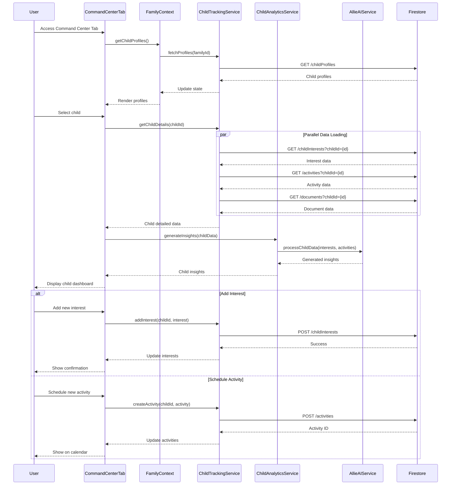

# Command Center Tab

## What this tab is for
The Command Center (Children Tracking Tab) serves as the central hub for managing and monitoring child-related activities, interests, and development. For parents, it provides comprehensive tracking of children's interests, activities, school events, and developmental milestones with AI-assisted insights. For children, it offers a personalized view of their own interests, achievements, and upcoming activities. This tab helps families maintain organized information about each child and promotes better understanding of children's evolving needs and interests.

## Key React pieces
| Component / Hook | File path | One-line responsibility |
|------------------|-----------|-------------------------|
| ChildrenTrackingTab | src/components/dashboard/tabs/ChildrenTrackingTab.jsx | Main container orchestrating all child-related tracking interfaces |
| KidsInterestsTab | src/components/dashboard/tabs/KidsInterestsTab.jsx | Manages and displays children's interests and preferences |
| ActivityTab | src/components/dashboard/tabs/ActivityTab.jsx | Tracks extracurricular activities and associated logistics |
| FamilyAllieDrive | src/components/document/FamilyAllieDrive.jsx | Organizes and displays document storage for child-related files |
| ChildInsightDashboard | src/components/child/ChildInsightDashboard.jsx | Presents insights and analytics about child development |
| ChildTrackingService | src/services/ChildTrackingService.js | Backend service for storing and retrieving child data |
| ChildAnalyticsService | src/services/ChildAnalyticsService.js | Processes and analyzes child activity and interest data |

## Core data & API calls
* FamilyContext provider for family members and relationships
* EventContext provider for child-related events and activities
* Firebase Firestore operations for child profiles, interests, and activities
* AllieAIService for generating insights about child development and recommendations
* Document storage and retrieval via FamilyAllieDrive
* Child interest tracking and analysis
* Activity scheduling and management
* School event monitoring and academic tracking

## Current Feature Flags & Env Vars
| Flag / Var | Default | Description | Doc link |
|------------|---------|-------------|----------|
| None specific to this tab | - | - | - |

## Glossary
* **Activity** - Structured extracurricular engagement for children (sports, arts, clubs)
* **Interest** - Topic, hobby, or subject a child shows enthusiasm or curiosity about
* **Milestone** - Significant developmental achievement or life event for a child
* **Insight** - AI-generated observation about patterns in a child's development or interests
* **Gift Idea** - Potential present suggestion based on child's interests and preferences
* **Activity Provider** - Organization or individual that offers structured activities for children

## Recent changes *(auto-generated)*
```
7a7b746 Sun May 18 16:21:13 2025 +0200 Updated code
3864c63 Sat May 3 10:03:24 2025 +0200 Updated code
ab99d5f Tue Apr 29 11:17:09 2025 +0200 Updated code
d186d5e Thu Apr 24 11:01:50 2025 +0200 Updated code
cd10668 Thu Apr 24 10:08:51 2025 +0200 Updated code
```

## Dev commands & storybook entries
* Run the app: `npm start` then navigate to the Command Center tab
* Test child tracking: `npm run test -- --testPathPattern=ChildrenTracking`
* View child components in isolation: `npm run storybook` then navigate to Children section
* Storybook entries:
  * `ChildProfileCard.stories.jsx`
  * `InterestTracker.stories.jsx`
  * `ActivitySchedule.stories.jsx`
  * `MilestoneTimeline.stories.jsx`
* Cypress specs: `cypress/integration/children/child_tracking.spec.js`

## How the entire tab works end-to-end

### User Journey
1. User navigates to Dashboard → Command Center tab
2. System loads personalized content based on user role (parent vs. child)
3. For parents: Tab shows child selector and multi-section dashboard with interest tracking, activities, documents, and insights
4. For children: Tab displays personalized view of their own interests, achievements, and upcoming activities
5. Parents can add/edit interests, schedule activities, upload documents, and view development insights
6. Children can view their own data and provide input on interests and preferences
7. AI-generated suggestions offer personalized activity and gift recommendations based on interests

### State & Data Flow
- **Context Providers**: Uses `FamilyContext` and `EventContext` for state management
- **Hooks**: `useChildTracking()` for profiles, `useActivityManagement()` for activities
- **State Flow**:
  - Initial load: `ChildrenTrackingTab` fetches profiles, interests, activities, and documents
  - Child selection: Updates `selectedChildId` → triggers data refresh for selected child
  - Interest tracking: Interest updates → database storage → analytics processing → insight generation
  - Activity management: Activity creation → scheduling → document association → calendar integration
  - Document handling: Upload → categorization → association with child/activity → storage

### API Sequence
1. **Load Child Profiles**: `GET /childProfiles?familyId={id}` - Retrieves all children's basic profiles
2. **Load Selected Child**: `GET /childProfiles/{id}` - Fetches detailed profile for selected child
3. **Load Interests**: `GET /childInterests?childId={id}` - Retrieves child's interests and preferences
4. **Load Activities**: `GET /activities?childId={id}` - Gets child's scheduled activities
5. **Load Documents**: `GET /documents?childId={id}` - Retrieves child-related documents
6. **Add/Update Interest**: `POST/PUT /childInterests` - Creates or updates interest record
7. **Schedule Activity**: `POST /activities` - Creates new activity with scheduling
8. **Generate Insights**: `POST /childInsights/generate` - Processes data for developmental insights
9. **Upload Document**: `POST /documents` - Uploads and categorizes child-related documents

### Side-effects & Cross-tab Links
- **Calendar Tab**: Activity scheduling creates events in Family Calendar
- **Knowledge Graph**: Child data contributes to family relationship network
- **Documents Tab**: Child documents are accessible in the main Documents tab
- **Survey System**: Child survey responses influence interest tracking and insights
- **Gift Ideas**: Interest tracking feeds into gift suggestion algorithms
- **Notification System**: Activity reminders and milestone celebrations trigger notifications

### Failure & Edge Cases
- **Multiple Children**: Handles efficient switching between different children's data
- **Privacy Controls**: Child accounts can only see their own data, not siblings'
- **Document Storage Limits**: Manages quota restrictions for document uploads
- **Activity Conflicts**: Detects and warns about scheduling conflicts
- **Data Sparsity**: Provides guidance for adding initial data when profiles are new
- **Age Appropriateness**: Filters activities and content based on child's age

### Mermaid Sequence Diagram


## Open TODOs / tech-debt
- [ ] Implement advanced filtering for activities by type and schedule
- [ ] Add export functionality for child development reports
- [ ] Improve mobile responsiveness for activity cards
- [ ] Implement multi-child comparison views for parents
- [ ] Add AI-powered development milestone tracking