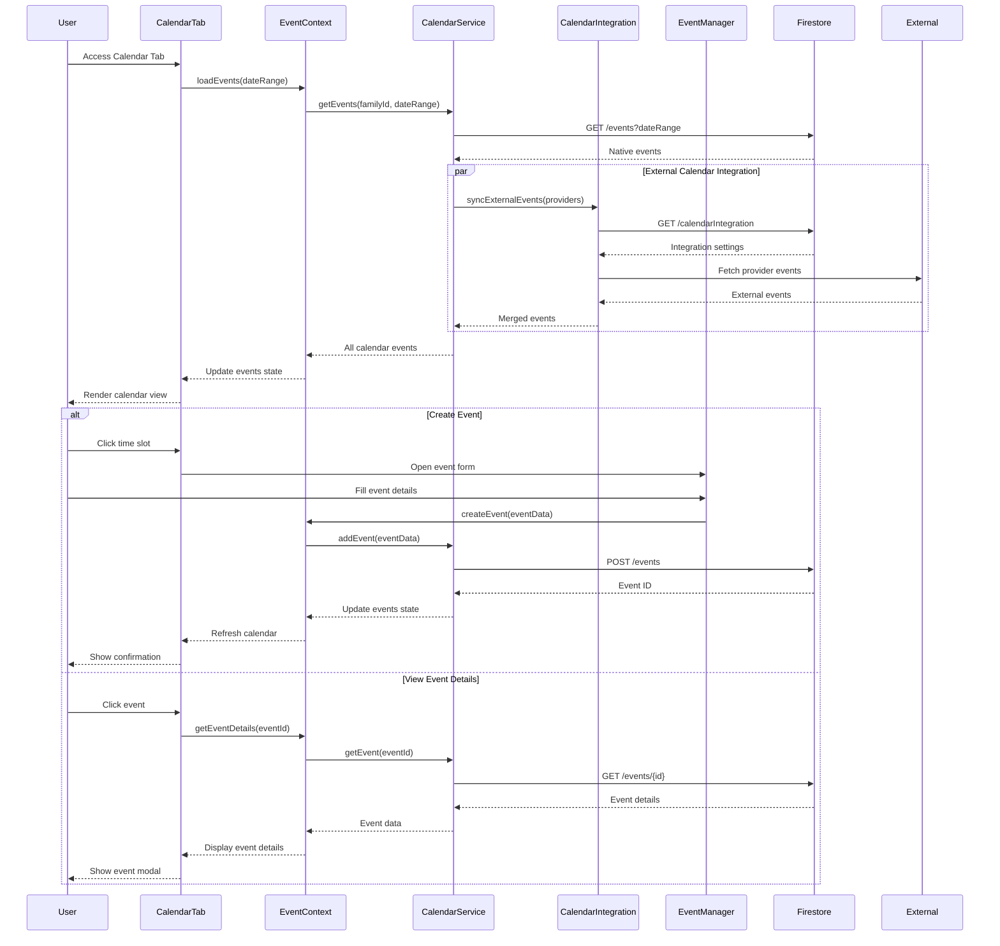

# Family Calendar Tab

## What this tab is for
The Family Calendar tab provides a comprehensive scheduling interface for families to manage, view, and coordinate events. For parents, it offers full event management capabilities including creation, editing, and deletion of family events with detailed metadata. For children, it presents a read-only view of family activities and appointments relevant to them. The calendar supports multiple view options (day, week, month) and integrates with external calendar sources to provide a unified scheduling experience.

## Key React pieces
| Component / Hook | File path | One-line responsibility |
|------------------|-----------|-------------------------|
| CalendarTab | src/components/dashboard/tabs/CalendarTab.jsx | Main container for the calendar interface with view selection |
| GoogleStyleCalendarView | src/components/calendar/GoogleStyleCalendarView.jsx | Primary calendar grid with time slots and event rendering |
| EventManager | src/components/calendar/EnhancedEventManager.jsx | Modal for creating and editing calendar events |
| EventsList | src/components/calendar/EventsList.jsx | Displays chronological list of upcoming events |
| EventDetails | src/components/calendar/EventDetails.jsx | Shows detailed information about a selected event |
| CalendarHeader | src/components/calendar/CalendarHeader.jsx | Navigation controls for date ranges and view options |
| CalendarFilters | src/components/calendar/CalendarFilters.jsx | Filters for event types, categories, and family members |

## Core data & API calls
* EventContext provider for CRUD operations on calendar events
* FamilyContext provider for family member information
* CalendarService for event storage and retrieval
* Firebase Firestore operations for event persistence
* EventStore service for local event management
* External calendar integration (Google, Apple) via CalendarService
* MergedEventParser for handling events from multiple sources

## Current Feature Flags & Env Vars
| Flag / Var | Default | Description | Doc link |
|------------|---------|-------------|----------|
| None specific to this tab | - | - | - |

## Glossary
* **Event** - Scheduled activity with date, time, title, and optional attendees
* **Attendee** - Family member assigned to or participating in a calendar event
* **View Mode** - Calendar display format (day, week, month) for different time horizons
* **Event Category** - Classification of events by purpose or type (medical, school, activity, etc.)
* **Recurring Event** - Event that repeats on a defined schedule (daily, weekly, monthly)
* **Event Source** - Origin of calendar events (app native, Google Calendar, Apple Calendar)

## Recent changes *(auto-generated)*
```
7a7b746 Sun May 18 16:21:13 2025 +0200 Updated code
```

## Dev commands & storybook entries
* Run the app: `npm start` then navigate to the Family Calendar tab
* Test calendar functionality: `npm run test -- --testPathPattern=CalendarCRUD`
* View calendar components in isolation: `npm run storybook` then navigate to Calendar section
* Storybook entries:
  * `GoogleStyleCalendar.stories.jsx`
  * `EventManager.stories.jsx`
  * `RecurringEventEditor.stories.jsx`
* Cypress specs: 
  * `cypress/integration/calendar/calendar_events.spec.js`
  * `cypress/integration/calendar/event_creation.spec.js`

## How the entire tab works end-to-end

### User Journey
1. User navigates to Dashboard → Family Calendar tab
2. System initializes calendar and loads events from multiple sources (native app, Google, Apple)
3. User can switch between day, week, and month views using calendar header controls
4. Parent users can create new events by clicking on time slots or the "Create Event" button
5. Event creation/editing flows through EnhancedEventManager component with form validation
6. Users can filter events by category, family member, or source using filter controls
7. Event clicks show detailed information and edit options (for parents) or view-only details (for children)

### State & Data Flow
- **Context Providers**: Uses `EventContext` and `FamilyContext` for state management
- **Hooks**: `useEvent()` provides calendar operations, `useCalendarIntegration()` for external sources
- **State Flow**:
  - Initial load: `EventContext` fetches events and populates `events` state
  - Integration: External calendar sources fetch and merge events into unified state
  - Event creation: Form data → validation → creation → state update → UI refresh
  - View changes: View type and date range updates trigger event fetching/filtering
  - Event updates: Edit actions → update event data → update state → UI refresh

### API Sequence
1. **Load Events**: `GET /events?familyId={id}&range={start,end}` - Retrieves events in date range
2. **External Calendar Sync**: `GET /calendarIntegration/{provider}/events` - Fetches external events
3. **Create Event**: `POST /events` - Creates new calendar event
4. **Update Event**: `UPDATE /events/{id}` - Modifies existing event
5. **Delete Event**: `DELETE /events/{id}` - Removes event from calendar
6. **Get Attendees**: `GET /families/{id}/members` - Retrieves family members for attendee selection
7. **Recurring Events**: `POST /events/recurring` - Creates recurring event series
8. **Event Relationships**: `GET /events/{id}/related` - Retrieves events related to selected event

### Side-effects & Cross-tab Links
- **Event Creation from Other Tabs**: Chore approvals, rewards, and tasks can create calendar events
- **Dashboard Integration**: Calendar events appear in dashboard widgets
- **Notifications**: Event reminders trigger notifications at configured intervals
- **Task Sequences**: Calendar events may be part of multi-step family processes
- **Knowledge Graph**: Event participation builds relationship strength in family graph

### Failure & Edge Cases
- **External Calendar Sync Failure**: Degrades gracefully to show only native events
- **Offline Mode**: Caches events for offline viewing with sync on reconnection
- **Date Range Limits**: Handles reasonable date ranges to prevent performance issues
- **Recurring Event Conflicts**: Detects and highlights overlapping recurring events
- **Permission Control**: Enforces read-only view for children with edit controls hidden
- **Event Collision**: Highlights overlapping events with visual indicators

### Mermaid Sequence Diagram


## Open TODOs / tech-debt
- [ ] Improve performance when displaying large number of events
- [ ] Add timezone support for families in different locations
- [ ] Implement better conflict detection for overlapping events
- [ ] Add print view for calendar
- [ ] Fix drag-and-drop event editing on mobile devices