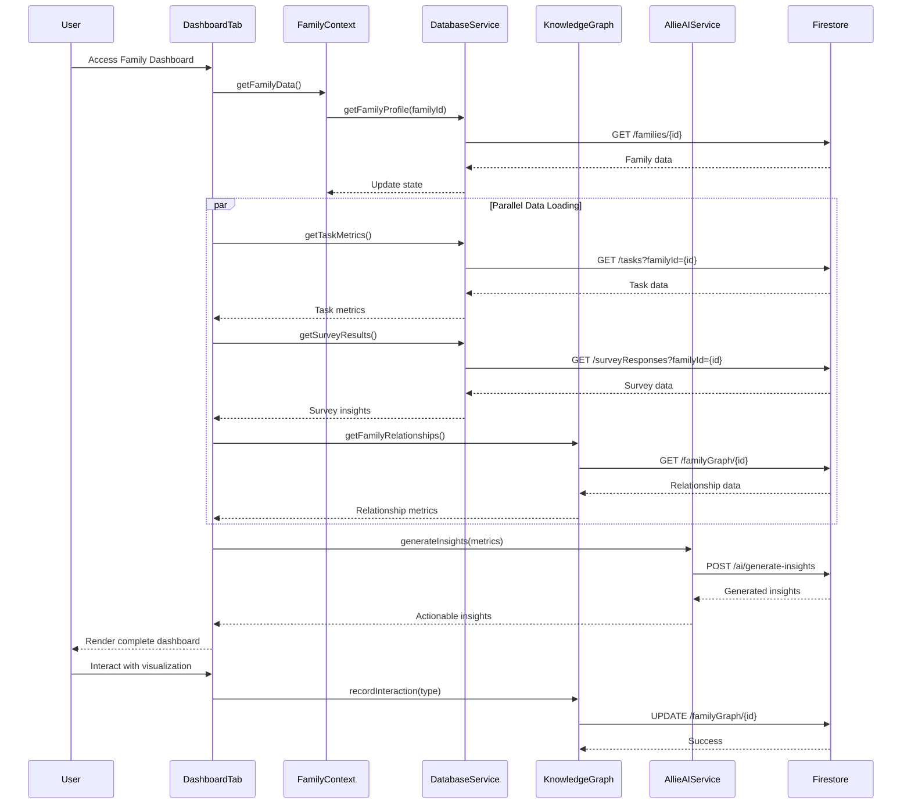

# Family Dashboard Tab

## What this tab is for
The Family Dashboard serves as the central hub for monitoring family health, progress, and insights. For parents, it provides comprehensive visualizations of family dynamics, survey responses, and workload distribution across various categories, enabling informed decisions about family management. For children, it offers a simplified view highlighting achievements, upcoming events, and family milestones. The dashboard aggregates data from multiple sources to present actionable insights about family balance and well-being.

## Key React pieces
| Component / Hook | File path | One-line responsibility |
|------------------|-----------|-------------------------|
| DashboardTab | src/components/dashboard/tabs/DashboardTab.jsx | Main container orchestrating all dashboard visualizations and metrics |
| AIRelationshipInsights | src/components/dashboard/AIRelationshipInsights.jsx | Displays AI-generated insights about family relationships |
| RelationshipProgressChart | src/components/dashboard/RelationshipProgressChart.jsx | Visualizes relationship improvement over time |
| TaskDivisionVisualizer | src/components/dashboard/TaskDivisionVisualizer.jsx | Shows breakdown of task allocation between family members |
| FamilyJourneyChart | src/components/dashboard/FamilyJourneyChart.jsx | Charts family progress through defined milestones and cycles |
| CalendarDashboardWidget | src/components/dashboard/CalendarDashboardWidget.jsx | Shows upcoming family events and appointments |
| CoupleRelationshipChart | src/components/dashboard/CoupleRelationshipChart.jsx | Displays relationship health metrics for partners |

## Core data & API calls
* FamilyContext provider for family structure, survey responses, and achievement data
* SurveyContext provider for analyzing questionnaire responses and patterns
* Firebase Firestore operations for family metrics and insights
* recharts library for data visualization components
* TaskWeightCalculator utility for workload balance metrics
* AllieAIService for generating personalized insights from family data
* DatabaseService for retrieving family history and metric data
* Historical data analysis through getWeekHistoryData function

## Current Feature Flags & Env Vars
| Flag / Var | Default | Description | Doc link |
|------------|---------|-------------|----------|
| None specific to this tab | - | - | - |

## Glossary
* **Impact Insight** - AI-generated observation about family patterns or opportunities
* **Weighted Score** - Numerical representation of task effort accounting for emotional labor
* **Task Balance** - Measure of equitable distribution of responsibilities between parents
* **Family Priority** - User-defined area of focus for family improvement
* **Completion Rate** - Percentage of scheduled tasks or habits successfully completed
* **Cycle Progress** - Advancement through a defined family time period with specific goals

## Recent changes *(auto-generated)*
```
7a7b746 Sun May 18 16:21:13 2025 +0200 Updated code
42174f7 Sat Apr 26 10:59:29 2025 +0200 Updated code
c457d3c Thu Apr 24 09:09:36 2025 +0200 Updated code
10869bc Wed Apr 23 08:58:18 2025 +0200 Updated code
21714b5 Wed Apr 23 08:42:25 2025 +0200 Updated code
```

## Dev commands & storybook entries
* Run the app: `npm start` then navigate to the Family Dashboard tab
* Test visualization rendering: `npm run test -- --testPathPattern=dashboard`
* View dashboard components in isolation: `npm run storybook` then navigate to Dashboard section
* Storybook entries:
  * `DashboardMetrics.stories.jsx`
  * `BalanceVisualizations.stories.jsx`
  * `FamilyProgressCharts.stories.jsx`
* Cypress specs: `cypress/integration/dashboard/dashboard_metrics.spec.js`

## How the entire tab works end-to-end

### User Journey
1. User navigates to Dashboard → Family Dashboard tab
2. Tab initializes and loads personalized content based on user role (parent vs. child)
3. Dashboard components fetch data from multiple sources (surveys, tasks, events, habits)
4. Visualizations render with aggregated metrics and insights
5. User can interact with charts, filter data, and view detailed breakdowns
6. Dashboard updates in real-time as family members complete tasks or surveys

### State & Data Flow
- **Context Providers**: Uses `FamilyContext`, `SurveyContext`, and `EventContext`
- **Hooks**: `useFamilyKnowledgeGraph()` for relationships, `useSurveyAnalysis()` for patterns
- **State Flow**:
  - Initial load: `DashboardTab` fetches family metrics and distributes to child components
  - Data aggregation: Raw data from multiple collections transformed into visualization formats
  - Insight generation: AI service processes metrics to generate actionable recommendations
  - Refresh cycle: Dashboard auto-refreshes data at configurable intervals

### API Sequence
1. **Load Family Profile**: `GET /families/{id}` - Retrieves core family structure data
2. **Load Metrics**: `GET /familyMetrics/{id}` - Fetches dashboard metrics and KPIs
3. **Load Task Data**: `GET /tasks?familyId={id}` - Retrieves task assignment and completion data
4. **Load Survey Results**: `GET /surveyResponses?familyId={id}` - Gets aggregated survey data
5. **Load Calendar Events**: `GET /events?familyId={id}&future=true&limit=10` - Gets upcoming events
6. **Generate Insights**: `POST /ai/generate-insights` - Processes data to create recommendations
7. **Load Habits Data**: `GET /habits?familyId={id}` - Retrieves habit tracking information
8. **Save Dashboard State**: `UPDATE /userPreferences/{id}` - Saves dashboard configuration

### Side-effects & Cross-tab Links
- **Calendar Tab**: Events data shared between Calendar and Dashboard widgets
- **Tasks Tab**: Task completion affects workload balance visualizations
- **Chore System**: Chore and reward data feeds into completion metrics
- **Knowledge Graph**: User interactions with dashboard create relationship graph edges
- **Notifications**: Notable insights may trigger notification recommendations
- **Survey System**: Completion of surveys updates dashboard metrics in real-time

### Failure & Edge Cases
- **Data Sparsity**: Shows placeholder visualizations with guidance when insufficient data exists
- **Network Offline**: Uses cached metrics with timestamp indicators for offline mode
- **Permission Control**: Filters sensitive metrics based on user role and age
- **Empty States**: Provides onboarding guidance when no data is available for visualization
- **Stale Data**: Implements refresh controls with time-since-update indicators

### Mermaid Sequence Diagram


## Open TODOs / tech-debt
- [ ] Optimize chart rendering performance on mobile devices
- [ ] Add data caching for better offline support
- [ ] Implement lazy loading for dashboard widgets
- [ ] Add customization options for widget arrangement
- [ ] Fix responsive layout issues on extra small screens