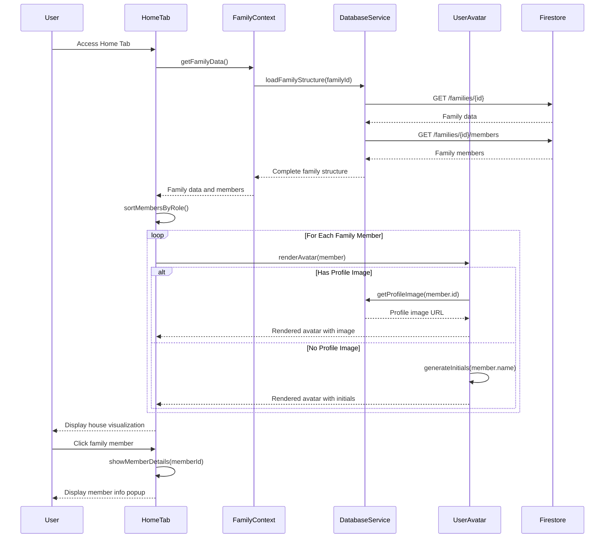

# Home Tab

## What this tab is for
The Home tab serves as the welcoming dashboard for users, providing a visual representation of the family structure. It displays a charming house visualization with family members organized by role (adults at the top, children at the bottom), offering users a central hub to see their family at a glance. Both parents and children see the same view, emphasizing the family unit.

## Key React pieces
| Component / Hook | File path | One-line responsibility |
|------------------|-----------|-------------------------|
| HomeTab | src/components/dashboard/tabs/HomeTab.jsx | Renders the family house visualization with member avatars |
| UserAvatar | src/components/common/UserAvatar.jsx | Displays user profile pictures or initials with styling |
| useFamily | src/contexts/FamilyContext.js | Provides access to family structure data and member information |

## Core data & API calls
* FamilyContext provider for family members and family name
* Filters family members into adults and children based on role property

## Current Feature Flags & Env Vars
| Flag / Var | Default | Description | Doc link |
|------------|---------|-------------|----------|
| None specific to this tab | - | - | - |

## Glossary
* **Family Member** - User belonging to a family group with properties like name, role, and optional age
* **Family Name** - Custom name assigned to the family group that appears on the house sign
* **Role** - Categorization of family members (parent/adult or child/kid) determining their position in the house

## Recent changes *(auto-generated)*
No recent specific changes detected in Git history for this tab.

## Dev commands & storybook entries
* Run the app: `npm start` then navigate to the Home tab
* No specific Storybook entries for this component
* No specific Cypress tests for this component

## How the entire tab works end-to-end

### User Journey
1. User logs in and is automatically directed to the Home tab as the default landing page
2. System loads family data and renders house visualization with family members
3. Adults appear at the top of the house structure; children appear at the bottom
4. Each family member is represented by their profile picture or initials in a styled avatar
5. The family name appears on a decorative house sign above the visualization
6. Users can click on family member avatars to view basic profile information
7. Navigation to other app sections is available through the main navigation menu

### State & Data Flow
- **Context Providers**: Uses `FamilyContext` for family structure data
- **Hooks**: `useFamily()` provides access to family members and family name
- **State Flow**:
  - Initial load: `HomeTab` fetches family structure from `FamilyContext`
  - Family sorting: Members categorized by role (adult/child) for proper placement
  - Avatar rendering: Profile images loaded or initials generated for each member
  - Basic interactions: Click handlers for family member information display
  - No complex state manipulation as this is primarily a view-only tab

### API Sequence
1. **Load Family Data**: `GET /families/{id}` - Retrieves basic family structure
2. **Load Family Members**: `GET /families/{id}/members` - Fetches all family member details
3. **Load Profile Images**: For each member with profile image, loads from storage service
4. **Check Family Settings**: `GET /familySettings/{id}` - Retrieves customization settings like house theme

### Side-effects & Cross-tab Links
- **Profile Management**: Changes to family member profiles update the house visualization
- **User Avatar**: The avatar component is shared across the application for consistent styling
- **Family Context**: Family data loaded here is leveraged by all other tabs
- **Knowledge Graph**: Family structure forms the foundation of the family knowledge graph
- **Navigation Hub**: Serves as the central starting point for accessing other app features

### Failure & Edge Cases
- **Missing Images**: Gracefully falls back to initials when profile images are unavailable
- **Large Families**: Handles scaling and layout adjustments for families with many members
- **Single-Parent Families**: Adapts house visualization for various family structures
- **Empty Families**: Shows onboarding guidance for adding family members if none exist
- **Slow Loading**: Shows skeleton UI during data fetching to maintain responsive experience

### Mermaid Sequence Diagram

## Open TODOs / tech-debt
- [ ] Add ability to reorder family members
- [ ] Implement drag-and-drop functionality for family organization
- [ ] Add animations for house elements