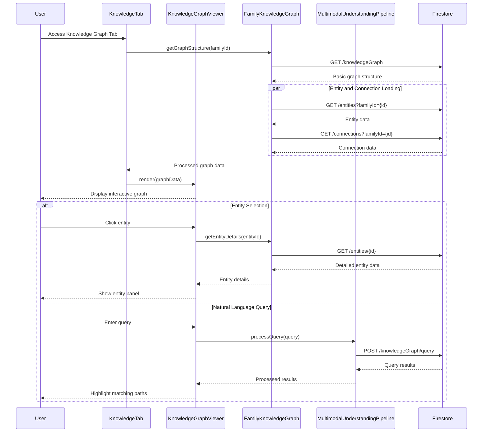

# Knowledge Graph Tab

## What this tab is for
The Knowledge Graph tab provides an interactive visualization of the family's information network, showing connections between people, events, tasks, and documents. For parents, it offers a comprehensive view of all family data with query capabilities and insight generation. For children, it presents a simplified view focusing on their own connections and relevant information. This tab helps users understand relationships between different data points in their family system and leverage that knowledge for better planning and coordination.

## Key React pieces
| Component / Hook | File path | One-line responsibility |
|------------------|-----------|-------------------------|
| KnowledgeTab | src/components/dashboard/tabs/KnowledgeTab.jsx | Simple container that holds the knowledge graph viewer |
| KnowledgeGraphViewer | src/components/knowledge/KnowledgeGraphViewer.jsx | Main component that visualizes and allows interaction with the knowledge graph |
| DocumentRelationshipVisualizer | src/components/document/DocumentRelationshipVisualizer.jsx | Shows connections between documents and other entities |
| FamilyKnowledgeGraph | src/services/FamilyKnowledgeGraph.js | Service for retrieving and manipulating knowledge graph data |
| MultimodalUnderstandingPipeline | src/services/knowledge/index.js | Processes different types of data for integration in the knowledge graph |

## Core data & API calls
* FamilyContext provider for family ID and member information
* FamilyKnowledgeGraph service for retrieving graph structure
* Firebase Firestore operations for entity and connection data
* Document relationship analysis via DocumentRelationshipVisualizer
* Knowledge graph querying with natural language via MultimodalUnderstandingPipeline
* Entity and connection retrieval from the knowledge database
* Insight generation based on knowledge graph patterns

## Current Feature Flags & Env Vars
| Flag / Var | Default | Description | Doc link |
|------------|---------|-------------|----------|
| None specific to this tab | - | - | - |

## Glossary
* **Entity** - A node in the knowledge graph representing a person, event, task, or document
* **Connection** - A relationship between two entities in the knowledge graph
* **Entity Type** - Classification of entities (family, person, task, event, insight, document)
* **Knowledge Query** - Natural language question about relationships in the family data
* **Insight** - AI-generated observation based on patterns in the knowledge graph
* **Graph Stats** - Metrics about the knowledge graph (number of entities, connections, etc.)

## Recent changes *(auto-generated)*
```
7a7b746 Sun May 18 16:21:13 2025 +0200 Updated code
a792f56 Sun Apr 13 23:20:10 2025 +0200 Updated code
ba4f04b Sun Apr 13 22:33:41 2025 +0200 Updated code
```

## Dev commands & storybook entries
* Run the app: `npm start` then navigate to the Knowledge Graph tab
* Test knowledge graph: `npm run test -- --testPathPattern=KnowledgeGraph`
* View knowledge components in isolation: `npm run storybook` then navigate to Knowledge section
* Storybook entries:
  * `KnowledgeGraphViewer.stories.jsx`
  * `EntityConnectionVisualization.stories.jsx`
* Cypress specs: `cypress/integration/knowledge/knowledge_graph.spec.js`

## How the entire tab works end-to-end

### User Journey
1. User navigates to Dashboard → Knowledge Graph tab
2. System loads and renders the family's knowledge graph with entities and connections
3. Initial view shows high-level family connections with main entity types color-coded
4. User can zoom, pan, and filter the graph to focus on specific entity types or relationships
5. Clicking on an entity displays detailed information and its direct connections
6. Search functionality allows finding specific entities or exploring connections through natural language queries
7. Parents can view AI-generated insights based on patterns in the knowledge graph

### State & Data Flow
- **Context Providers**: Uses `FamilyContext` for family data access
- **Hooks**: `useFamilyKnowledgeGraph()` provides graph manipulation functions
- **State Flow**:
  - Initial load: `KnowledgeTab` fetches graph structure via `FamilyKnowledgeGraph` service
  - Graph rendering: Entity and connection data formatted for visualization library
  - User interaction: Selection events → detail panel updates → focused view changes
  - Search queries: Natural language input → query processing → graph highlighting
  - Insight generation: Graph analysis → pattern detection → insight formatting

### API Sequence
1. **Load Graph Structure**: `GET /knowledgeGraph?familyId={id}` - Retrieves basic graph structure
2. **Load Entities**: `GET /entities?familyId={id}` - Fetches entity details for the graph
3. **Load Connections**: `GET /connections?familyId={id}` - Retrieves relationship data between entities
4. **Process Query**: `POST /knowledgeGraph/query` - Executes natural language query against the graph
5. **Generate Insights**: `POST /knowledgeGraph/insights` - Analyzes graph for pattern-based insights
6. **Entity Details**: `GET /entities/{id}` - Retrieves detailed information for a selected entity
7. **Update View**: Client-side state updates to filter, focus, or rearrange the graph visualization
8. **Export Data**: `GET /knowledgeGraph/export` - Generates downloadable graph data in requested format

### Side-effects & Cross-tab Links
- **Document Tab**: Document viewing creates new connections in the knowledge graph
- **Calendar Tab**: Event participation strengthens person-to-person connections
- **Tasks Tab**: Task completion adds new entities and relationships
- **Family Dashboard**: Knowledge graph insights feed into dashboard visualizations
- **Chore System**: Chore assignments generate connections between people and tasks
- **Search System**: Knowledge graph powers intelligent search across family data

### Failure & Edge Cases
- **Large Graphs**: Implements progressive loading and rendering for families with extensive data
- **Complex Queries**: Provides fallback and hints for natural language queries that are too complex
- **Missing Data**: Shows placeholder visualizations with guidance when graph is sparse
- **Privacy Controls**: Filters sensitive connections based on user role and age
- **Layout Optimization**: Handles automatic graph layout to prevent visual clutter
- **Export Limits**: Manages size constraints when exporting large graph data

### Mermaid Sequence Diagram


## Open TODOs / tech-debt
- [ ] Improve graph visualization performance with large datasets
- [ ] Add export functionality for knowledge graph data
- [ ] Implement more advanced filtering options
- [ ] Add ability to manually create and edit connections
- [ ] Enhance natural language query capabilities