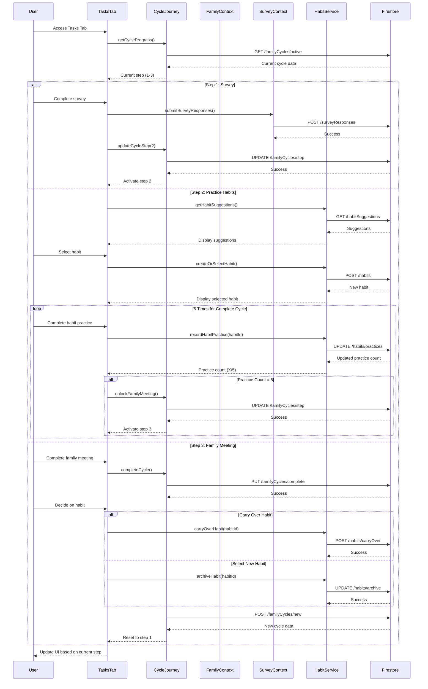

xX Component / Hook | File path | One-line responsibility |
|------------------|-----------|-------------------------|
| TasksTab | src/components/dashboard/tabs/TasksTab.jsx | Main container coordinating all task-related components |
| CycleJourney | src/components/cycles/CycleJourney.jsx | Displays family cycle progress with survey completion status |
| EnhancedHabitsSection | src/components/dashboard/EnhancedHabitsSection.jsx | Manages habit display, creation, and completion tracking |
| FilterableRadarChart | src/components/dashboard/FilterableRadarChart.jsx | Visualizes workload distribution with filtering capabilities |
| EnhancedImbalanceRadarChart | src/components/dashboard/EnhancedImbalanceRadarChart.jsx | Renders radar chart showing imbalances between family members |
| WorkloadRadarLayout | src/components/dashboard/WorkloadRadarLayout.jsx | Layouts the radar visualization with interactive categories |
| useCycleDueDate | src/hooks/useEvent.js | Manages due dates and progress for family cycles |

## Core data & API calls
* FamilyContext provider for family members, survey responses, and streak data
* SurveyContext provider for survey responses and question sets
* NotificationContext provider for celebrations and user feedback
* Firebase Firestore operations for habits collection (create, read, update)
* Event management via EventContext and EventStore
* Task imbalance analysis via SurveyAnalysisUtil
* Habit generation via HabitGenerationService
* Calendar integration via CalendarService

## Current Feature Flags & Env Vars
| Flag / Var | Default | Description | Doc link |
|------------|---------|-------------|----------|
| None specific to this tab | - | - | - |

## Glossary
* **Habit** - A tracked recurring task with cue, action, and reward components
* **Family Cycle** - Time-boxed period (usually weekly) for tracking family progress 
* **Streak** - Count of consecutive completions of a specific habit
* **Imbalance** - Percentage difference in workload distribution between parents
* **Atomic Habit** - Small, consistent action designed to build into larger behavior change
* **Task Category** - Classification of family work (e.g., Visible/Invisible Household/Parental Tasks)
* **Habit Practice** - Individual completion of a habit action, with 5 practices required per cycle
* **3-Step Process** - Survey → Practice Habits → Family Meeting workflow that structures each family cycle

## Recent changes *(auto-generated)*
```
7a7b746 Sun May 18 16:21:13 2025 +0200 Updated code
2dd4139 Tue Apr 22 18:45:35 2025 +0200 Updated code
1f37c79 Tue Apr 22 18:22:58 2025 +0200 Updated code
84f79cd Tue Apr 22 18:15:57 2025 +0200 Updated code
09b5374 Tue Apr 22 18:11:38 2025 +0200 Updated code
```

## Dev commands & storybook entries
* Run the app: `npm start` then navigate to the My Tasks tab
* Test habit creation: `npm run test -- --testPathPattern=HabitCreation`
* Test cycle management: `npm run test -- --testPathPattern=CycleJourney`
* Storybook entries: 
  * `HabitCard.stories.jsx`
  * `CycleJourneyProgress.stories.jsx`
  * `RadarChartVisualization.stories.jsx`

## Process Flow & Sequence

### Intent matrix
| User utterance example | Intent key | Maps to UI / API action | Notes / params |
|------------------------|------------|-------------------------|----------------|
| "Show me the area where we have the biggest imbalance" | `getTopImbalance` | `WorkloadRadarLayout.highlightTopImbalance()` → Selector + highlight on radar chart | Returns category with highest imbalance percentage |
| "Create a new habit for Invisible Household tasks" | `createHabit` | `HabitGenerationService.createHabit()` → `POST /habits` | Category=InvisibleHousehold |
| "Complete my habit practice for today" | `completeHabitPractice` | `HabitService.recordHabitPractice()` → `UPDATE /habits/{id}/practices` | Increments practice count for current habit |
| "Change my current habit" | `changeHabit` | `HabitService.resetHabit()` → Dialog + `POST /habits` | Shows confirmation dialog first |
| "Show me my progress in the current cycle" | `getCycleProgress` | `CycleJourney.getCycleProgress()` → Updates UI visualization | Displays current step and completion status |
| "Start the family meeting" | `startFamilyMeeting` | `CycleJourney.activateStep(3)` → `UPDATE /familyCycles/{id}/currentStep` | Only available when 5 practices completed |
| "Carry over my current habit to next cycle" | `carryOverHabit` | `HabitService.carryOverHabit()` → `POST /habits/{id}/carryOver` | After family meeting completion |
| "Show me suggestions for new habits" | `getHabitSuggestions` | `HabitGenerationService.suggestHabits()` → `POST /habits/suggest` | Based on radar chart imbalances |
| "Complete the current survey" | `completeSurvey` | `SurveyContext.submitSurveyResponses()` → `POST /surveyResponses` | Activates step 2 of cycle |
| "What habits have I practiced the most?" | `getTopHabits` | `HabitService.getHabitHistory()` → `GET /habits/history` | Returns habit history with streak data |

### Function hooks
* `useHabitHelpers().createHabit(categoryId, habitTemplateId)` - Creates new habit from template or custom input
* `useHabitHelpers().recordHabitPractice(habitId)` - Records a single habit practice completion
* `useHabitHelpers().getHabitSuggestions(imbalanceData)` - Gets personalized habit suggestions
* `useHabitHelpers().carryOverHabit(habitId)` - Transfers habit to new cycle with reset practice count
* `useHabitHelpers().resetHabit(habitId)` - Changes current habit with confirmation flow
* `useHabitHelpers().getHabitHistory()` - Retrieves habit history with streak information
* `useSurveyAnalysis().getTopImbalance()` - Returns the category with highest workload imbalance
* `useSurveyAnalysis().submitSurveyResponses(responses)` - Submits survey responses and updates radar chart
* `useCycleDueDate().getCycleProgress()` - Gets current cycle data and active step
* `useCycleDueDate().updateCycleStep(stepNumber)` - Updates active step in current cycle
* `useCycleDueDate().completeCycle()` - Completes current cycle and prepares for next cycle
* ⚠ `useHabitHelpers().saveHabitForNextCycle(habitId)` - TODO: Implement function to specifically save current habit for next cycle

### Slot / entity schema
* `habitId: string` - Unique identifier for a habit
* `habitTemplateId: string` - Template identifier for pre-defined habits
* `categoryId: string` - Category from the radar chart
  * Enum values: `VisibleHousehold`, `InvisibleHousehold`, `VisibleParental`, `InvisibleParental`, `ChildDevelopment`, `Relationship`
* `practiceCount: number` - Number of practices completed (default: 0, max: 5)
* `cycleStep: number` - Current step in 3-step process 
  * Enum values: `1` (Survey), `2` (Practice Habits), `3` (Family Meeting)
* `surveyResponses: object` - Key-value pairs of survey question IDs and responses
* `imbalanceData: object` - Workload imbalance percentages by category
* `habitDescription: string` - Custom description for user-created habits
* `streakCount: number` - Number of consecutive days habit was practiced (default: 0)
* `cycleId: string` - Unique identifier for the current family cycle

### Safety & permission guardrails
* **Role-based access**:
  * Parent roles can access all features including radar chart, habit suggestions, and cycle management
  * Child roles can only see assigned habits and practice tracking (no radar chart or cycle management)
  * Parents can see all family members' habits; children can only see their own

* **Edge case handling**:
  * If survey not complete, return "Please complete the survey first" when trying to access step 2 features
  * If fewer than 5 practices completed, return "Complete 5 practices to unlock family meeting" when trying to access step 3
  * When changing habits mid-cycle, require explicit confirmation to prevent accidental progress loss
  * If trying to create habit without selecting category, prompt for category selection
  * If accessing radar chart with insufficient survey data, show placeholder with prompts to complete survey
  * Prevent family meeting activation before habit practice requirement is met
  * Check cycle expiration and prompt for cycle renewal if current cycle has ended

* **Data validation**:
  * Verify habitId exists before allowing practice recording
  * Validate survey responses against question schema before submission
  * Ensure selected categories exist in the imbalance data
  * Prevent practice count from exceeding maximum (5) per cycle
  * Verify current user has permission to modify selected habit

## Radar Chart Implementation Details

The radar chart is a critical visualization showing family workload imbalances across categories. Here are key implementation details:

### Personalized Survey Processing
1. Each family member receives a personalized survey with varying question distributions
2. Questions are sorted into 4 parentload buckets (Visible/Invisible Household/Parental Tasks)
3. A parent may get 15% of questions related to Invisible Household while a child might get 70%
4. The `SurveyAnalysisUtil.js` normalizes these differences to provide accurate comparisons
5. The survey processing accounts for role-specific weighting to ensure fair comparisons

### Real Data Visualization
1. Radar chart displays ONLY real data collected from actual family surveys
2. Filtering capability allows users to view different perspectives:
   - Individual family members (using avatar selectors)
   - Grouped data (all children vs. all parents)
   - Whole family view
3. Empty states display guidance for completing surveys when insufficient data exists
4. The `FilterableRadarChart` component includes selection controls for these filters
5. Avatar-based selector UI makes it easy to switch between family member perspectives

### Cycle-Over-Cycle Changes
1. The visualization tracks changes across all 3 cycles (initial survey + 2 follow-ups)
2. Key insights displayed:
   - Which categories are improving (reduced imbalance)
   - Which categories are worsening (increased imbalance)
   - Rate of change for each category (to identify slow-improving areas)
3. Color coding and trend arrows indicate improvement or decline
4. This helps parents identify the most effective areas to focus habit development
5. Historical data can be toggled via timeline selector to compare specific cycles

## How the entire tab works end-to-end

### User Journey
1. User navigates to Dashboard → My Tasks tab
2. System renders content based on user role (parent vs. child view)
3. For parents: Tab shows the 3-step process visualization at the top (Survey → Practice Habits → Family Meeting)
4. The 3-step visualization shows current cycle progress and which step is currently active
5. Users first complete the survey to identify workload imbalances shown in the radar chart
6. After the survey, users select a habit to practice (either from radar chart suggestions or Allie's recommendations)
7. Users must complete 5 "practices" of their selected habit before proceeding to the family meeting
8. Habit practices are tracked at the bottom of the screen with progress toward the required 5 completions
9. After 5 practices, the Family Meeting step becomes available to conclude the cycle

### State & Data Flow
- **Context Providers**: Uses `FamilyContext`, `SurveyContext`, and `EventContext`
- **Hooks**: `useHabitHelpers()` for habit management, `useSurveyAnalysis()` for imbalance detection
- **State Flow**:
  - Initial load: `TasksTab` loads habits, cycle data, and workload metrics
  - Cycle progression: Survey completion → habit selection → habit practices → family meeting
  - Habit tracking: Practice completion → update practice count (1/5, 2/5, etc.) → unlock family meeting at 5/5
  - Habit selection: Either from radar chart imbalance areas or from Allie-generated suggestions
  - Habit carry-over: Option to continue current habit into next cycle or select a new one
  - Habit change: Confirmation flow when changing habits mid-cycle (warns about losing progress)

### API Sequence
1. **Load Habits**: `GET /habits?familyId={id}&userId={id}` - Retrieves user's active habits
2. **Load Survey Data**: `GET /surveyResponses?familyId={id}&latest=true` - Gets latest survey responses
3. **Analyze Imbalance**: Client-side computation with `SurveyAnalysisUtil` using survey data
4. **Load Cycle Data**: `GET /familyCycles?familyId={id}&active=true` - Gets current family cycle
5. **Complete Habit Practice**: `UPDATE /habits/{id}/practices` - Records a habit practice (1-5)
6. **Create Habit**: `POST /habits` - Creates new habit from template or custom input
7. **Generate Suggestions**: `POST /habits/suggest` - Requests personalized habit suggestions
8. **Update Cycle Step**: `UPDATE /familyCycles/{id}/currentStep` - Updates which step is active (1-3)
9. **Complete Cycle**: `PUT /familyCycles/{id}/complete` - Marks cycle as complete after family meeting
10. **Carry Over Habit**: `POST /habits/{id}/carryOver` - Transfers habit to new cycle with reset practice count

### Habit Lifecycle
1. **Habit Selection**:
   - Parent completes survey, which generates the radar chart showing imbalance areas
   - Parent selects a habit either by clicking on a radar chart area or from Allie's suggestions
   - The selected habit appears in the habit tracking section at the bottom of the screen

2. **Habit Practices**:
   - Each habit requires 5 "practices" per cycle to unlock the family meeting
   - User clicks "Complete" to record each practice, updating the count (1/5, 2/5, etc.)
   - Users can practice more than 5 times if desired, continuing to build the habit
   - Habit practices can be completed once per day or multiple times based on habit type

3. **Habit Changes**:
   - Users can change their selected habit after at least one practice
   - System shows a confirmation dialog warning that changing habits will lose practice progress
   - If confirmed, new habit is selected and practice count resets to 0/5

4. **Cycle Transition**:
   - After family meeting, users are prompted to either:
     a) Carry current habit into next cycle (with practice count reset to 0/5)
     b) Select a new habit for the next cycle
   - If carrying over, habit history and streak information is preserved
   - If selecting new habit, current habit is archived with completion status

5. **Habit Completion Notifications**:
   - System notifies users of approaching practice goals (4/5 completed)
   - Celebration animations appear when all 5 practices are completed
   - Reminders appear if habits are not being practiced regularly

### Side-effects & Cross-tab Links
- **Calendar Integration**: Habit completions can generate calendar events via `CalendarService`
- **Notifications**: Habit streaks trigger celebration notifications and achievements
- **Knowledge Graph**: Habit patterns feed into the family relationship graph
- **Survey System**: Survey responses influence habit suggestions and imbalance detection
- **Chore System**: Task completion data from chores influences workload visualizations
- **Family Meeting**: Habit completion unlocks the family meeting component in the cycle

### Failure & Edge Cases
- **Empty Habits**: Shows onboarding flow for creating first habits when none exist
- **Survey Data Missing**: Provides placeholder visualizations with guidance to complete surveys
- **Offline Support**: Caches habit completions for sync when connection is restored
- **Role Switching**: Adapts UI when switching between parent and child accounts
- **Expired Cycles**: Handles transitioning between family cycles with data preservation
- **Habit Change Confirmation**: Warns users about losing progress when changing habits mid-cycle
- **Incomplete Practices**: Provides options to either extend cycle or carry incomplete habits forward

### Mermaid Sequence Diagram


## Open TODOs / tech-debt
- [ ] Refactor habit management into a dedicated hook for better separation of concerns
- [ ] Optimize radar chart rendering for mobile devices
- [ ] Add proper loading states for database operations
- [ ] Fix potential memory leak in cycle journey animation
- [ ] Implement habit carry-over UX between cycles
- [ ] Add confirmation dialog when changing habits mid-cycle
- [ ] Create analytics dashboard for habit completion trendsX