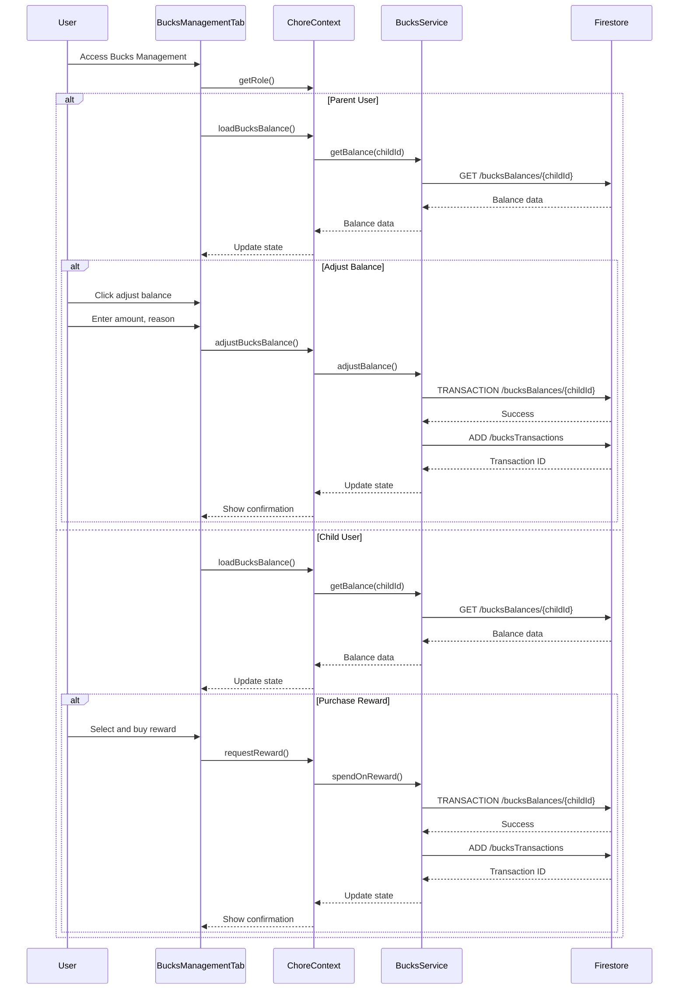

# Palsson Bucks Cheatsheet

## What are Palsson Bucks?

Palsson Bucks is a virtual currency system that helps parents reward children for completing chores and other positive behaviors. Children can earn Bucks and then spend them on rewards and privileges.

## Quick Reference

### For Parents

- **Access:** Dashboard → Bucks Management Tab
- **Currencies:** 1 completed chore = Bucks value set in template
- **Adjustments:** Add or remove Bucks manually with reason
- **Tips:** Give bonus Bucks for exceptional work
- **Approval:** Approve chores to automatically award Bucks
- **Reports:** View transaction history and balance stats

### For Kids

- **Access:** Dashboard → Bucks Tab
- **Earn:** Complete chores and get approved
- **Spend:** Purchase rewards from the Rewards Shop
- **Track:** View your current balance and history

## Earning Palsson Bucks

Children can earn Bucks through:

1. **Completed Chores** - When a parent approves a completed chore
2. **Bonuses/Tips** - Extra Bucks awarded for exceptional work
3. **Manual Additions** - Parents can add Bucks for special achievements
4. **Initial Balance** - Parents can set a starting balance

## Spending Palsson Bucks

Bucks can be spent on:

1. **Rewards** - Items in the Rewards Shop
2. **Privileges** - Special activities or benefits
3. **Activities** - Fun experiences or outings

## Parent Controls

### Managing Balances

1. Open the Bucks Management Tab
2. Select the "Balances" tab to view all children's accounts
3. Click "+" to add Bucks or "-" to deduct Bucks
4. Enter amount and reason
5. Click "Add/Deduct Bucks" to confirm

### Viewing Transactions

1. Open the Bucks Management Tab
2. Select the "Transactions" tab
3. Filter by child, date range, or transaction type
4. View detailed transaction history

### Settings

1. Open the Bucks Management Tab
2. Select the "Settings" tab
3. Configure auto-approval, notifications, and more

## Child Interface

### Viewing Balance

1. Open the Bucks Tab
2. See your current balance at the top
3. View recent transactions below

### Buying Rewards

1. Open the Bucks Tab
2. Select the "Rewards" tab
3. Browse available rewards
4. Click "Redeem Reward" on an item you can afford
5. Parent approval may be required

### Tracking History

1. Open the Bucks Tab
2. Select the "History" tab
3. View all your past transactions

## Common Scenarios

### Adding a Tip for Great Work

1. Go to the completed chore
2. Click "Add Tip"
3. Enter amount and reason
4. Confirm to award extra Bucks

### Refunding a Rejected Reward

When a parent rejects a reward request, Bucks are automatically refunded to the child's account.

### Manual Balance Adjustment

1. Open Bucks Management Tab
2. Click "+" next to child's name
3. Enter amount and reason
4. Confirm adjustment

## Tips and Best Practices

- **Consistency:** Maintain consistent Bucks values for similar tasks
- **Communication:** Explain the Bucks system and values to children
- **Balance:** Set reasonable prices for rewards
- **Motivation:** Use Bucks to encourage challenging tasks
- **Transparency:** Keep all transactions visible to build trust
- **Goals:** Help children set saving goals for larger rewards

## How to Configure Rewards

### Creating New Rewards

1. Navigate to Dashboard → Bucks Management Tab → Rewards
2. Click "Create New Reward"
3. Fill in the following details:
   - **Name**: What the reward is called
   - **Description**: Details about the reward
   - **Cost**: How many Bucks it costs
   - **Category**: Type of reward (Activity, Item, Privilege)
   - **Image**: Optional visual representation
   - **Availability**: One-time or recurring
   - **Approval Required**: Toggle if parent approval needed
4. Click "Save Reward" to add it to the Rewards Shop

### Managing Existing Rewards

1. Navigate to Dashboard → Bucks Management Tab → Rewards
2. View all existing rewards in a grid format
3. For each reward, you can:
   - **Edit**: Modify any reward details
   - **Disable/Enable**: Make rewards temporarily unavailable
   - **Delete**: Permanently remove a reward
   - **Duplicate**: Create a copy of the reward to modify

### Setting Effective Reward Prices

Follow these guidelines for balanced reward pricing:
- **Small rewards**: 5-20 Bucks (screen time, small treats)
- **Medium rewards**: 25-75 Bucks (small toys, special activities)
- **Large rewards**: 100-300 Bucks (bigger items, special outings)
- **Premium rewards**: 300+ Bucks (electronics, major privileges)

### Reward Best Practices

- Create a mix of immediate and saving-goal rewards
- Include rewards with different Bucks values
- Update rewards periodically to maintain interest
- Consider rewards that align with family values
- Include both tangible items and experience-based rewards

## How it Looks for Children

### Child Dashboard View

Children see a simplified, kid-friendly interface:
- **Current Balance**: Prominently displayed at the top
- **Recent Activity**: Shows latest transactions
- **Progress Bars**: Visual indicators of savings goals
- **Quick Actions**: Easy access to reward shop

### Rewards Shop Experience

When a child enters the Rewards Shop:
1. They see a grid of available rewards with images
2. Each reward shows:
   - Name and description
   - Cost in Bucks
   - Availability status
   - "Affordable" tag on items they can purchase
3. Clicking on a reward shows more details
4. Purchase flow:
   - Click "Buy Reward"
   - Confirmation dialog appears
   - If parent approval required, notification is sent
   - Upon purchase, animated celebration appears
   - Balance is immediately updated

### Transaction History for Kids

Children's transaction history is displayed in a simple, engaging format:
- Color-coded transactions (green for earning, red for spending)
- Simple language describing each transaction
- Grouped by day with total daily earning/spending
- Visual icons representing transaction types
- Search and filter options

### Motivation Elements

The child interface includes motivational features:
- Savings goal trackers with visual progress
- Milestone celebrations (animations when reaching round numbers)
- "Trending" section showing popular rewards
- "Recommended" section based on interests
- Streaks counter for consecutive days earning Bucks

## Troubleshooting

**Issue:** Balance doesn't update after completing a chore
**Solution:** Chore may need parent approval first

**Issue:** Child can't purchase a reward
**Solution:** Check if they have sufficient balance

**Issue:** Transaction doesn't appear in history
**Solution:** Refresh the page or check filters

**Issue:** Rewards not showing in child's view
**Solution:** Check if rewards are enabled and assigned to that child

**Issue:** Can't adjust balance manually
**Solution:** Ensure you have parent permissions and are in the Balances tab

## Technical Notes

- Transactions are stored in the `bucksTransactions` collection
- Balances are stored in the `bucksBalances` collection
- All transactions include metadata about their source (chore, reward, etc.)
- Balance updates are processed as atomic transactions to ensure consistency
- Rewards are stored in the `rewardTemplates` collection
- Purchased rewards are tracked in the `rewardInstances` collection

## How the entire tab works end-to-end

### User Journey
1. User accesses Dashboard → selects Bucks Management Tab
2. System renders either Parent view (with Balances/Transactions/Settings tabs) or Child view (with Dashboard/History/Rewards tabs) based on user role
3. For parents: Can view all child balances, manage transactions, and configure settings
4. For children: Can view their balance, transaction history, and available rewards

### Intent Matrix
| User utterance example | Intent key | Maps to UI / API action | Notes / params |
|--------------------------|--------------|--------------------------|-----------------|
| "Show Jake's Bucks balance" | `getBucksBalance` | `GET /bucksBalances/{childId}` | Requires childId |
| "Give 20 Bucks to Sarah for helping with dishes" | `addBucks` | `POST /bucksTransactions` | Requires childId, amount, reason |
| "Remove 10 Bucks from Jake for not finishing homework" | `deductBucks` | `POST /bucksTransactions` | Requires childId, amount, reason (negative transaction) |
| "Show all Bucks transactions from last week" | `getTransactions` | `QUERY /bucksTransactions` | Optional params: childId, dateRange |
| "Create a new reward for 50 Bucks" | `createReward` | `POST /rewardTemplates` | Requires name, description, cost |
| "Show rewards available to Jake" | `getAvailableRewards` | `QUERY /rewardTemplates` | Filtered by childId, availability |
| "Approve Jake's reward request" | `approveRewardRequest` | `UPDATE /rewardInstances/{id}` | Sets status to approved |
| "Reject Sarah's reward request" | `rejectRewardRequest` | `UPDATE /rewardInstances/{id}` | Sets status to rejected, triggers refund |
| "Initialize Sarah's Bucks account" | `initializeBucksAccount` | `SET /bucksBalances/{childId}` | Creates initial balance if not exists |
| "Show all pending reward requests" | `getPendingRewards` | `QUERY /rewardInstances` | Filtered by status="pending" |
| "Edit the Game Night reward" | `updateReward` | `UPDATE /rewardTemplates/{id}` | Modifies existing reward details |
| "Set auto-approval threshold to 20 Bucks" | `updateSettings` | `UPDATE /bucksSettings/{familyId}` | Updates family-wide Bucks settings |
| "What's my current Bucks balance?" | `getMyBalance` | `GET /bucksBalances/{currentUserId}` | For child users to check their own balance |
| "Buy the ice cream reward" | `purchaseReward` | `POST /rewardInstances` | Creates purchase request, updates balance |
| "Show my transaction history" | `getMyTransactions` | `QUERY /bucksTransactions` | Filtered by currentUserId |

### Function Hooks
- `useBucksBalance(childId)` - Get and update a child's Bucks balance
- `useTransactionHistory(childId, dateRange)` - Get transaction history with filters
- `useRewards(filters)` - Get rewards matching filters (cost, category, etc.)
- `useRewardRequests(status)` - Get reward requests matching status
- `BucksService.addBucks(childId, amount, reason)` - Add Bucks to child account
- `BucksService.deductBucks(childId, amount, reason)` - Remove Bucks from child account
- `BucksService.createReward(rewardData)` - Create new reward template
- `BucksService.updateReward(rewardId, rewardData)` - Update existing reward
- `BucksService.purchaseReward(childId, rewardId)` - Create reward purchase request
- `BucksService.approveRewardRequest(requestId)` - Approve reward request
- `BucksService.rejectRewardRequest(requestId)` - Reject reward request and refund Bucks
- `BucksService.getSettings()` - Get Bucks system settings
- `BucksService.updateSettings(settingsData)` - Update Bucks system settings
- `BucksService.initializeAccount(childId, initialBalance)` - Create new Bucks account
- ⚠ `BucksService.exportTransactions(dateRange)` - TODO: Add export functionality for transaction reports

### Slot / Entity Schema
```typescript
interface BucksTransaction {
  id: string;
  childId: string;
  amount: number;        // positive for additions, negative for deductions
  reason: string;
  source: TransactionSource;
  sourceId?: string;     // ID of chore/reward that triggered transaction
  timestamp: Date;
  createdBy: string;     // user ID of creator
}

enum TransactionSource {
  CHORE_COMPLETION = 'chore_completion',
  REWARD_PURCHASE = 'reward_purchase',
  MANUAL_ADJUSTMENT = 'manual_adjustment',
  REWARD_REFUND = 'reward_refund',
  INITIAL_BALANCE = 'initial_balance'
}

interface BucksBalance {
  childId: string;
  balance: number;
  lastUpdated: Date;
}

interface Reward {
  id: string;
  name: string;
  description: string;
  cost: number;
  category: RewardCategory;
  imageUrl?: string;
  availability: RewardAvailability;
  approvalRequired: boolean;
  limitPerChild?: number;
  expirationDate?: Date;
  createdBy: string;
}

enum RewardCategory {
  ACTIVITY = 'activity',
  ITEM = 'item',
  PRIVILEGE = 'privilege',
  SCREEN_TIME = 'screen_time'
}

enum RewardAvailability {
  SINGLE_USE = 'single_use',
  RECURRING = 'recurring',
  LIMITED = 'limited'  // uses limitPerChild
}

interface RewardInstance {
  id: string;
  rewardId: string;
  childId: string;
  status: RewardStatus;
  requestDate: Date;
  statusUpdatedDate?: Date;
  statusUpdatedBy?: string;
  notes?: string;
}

enum RewardStatus {
  PENDING = 'pending',
  APPROVED = 'approved',
  REJECTED = 'rejected',
  COMPLETED = 'completed'
}

interface BucksSettings {
  familyId: string;
  autoApprovalThreshold?: number;  // auto-approve rewards under this cost
  notificationsEnabled: boolean;
  requireApprovalForAll: boolean;  // if true, all rewards need approval
  childAutoRedeemEnabled: boolean; // allows children to redeem rewards without parent
}
```

### Safety & Permission Guardrails
• **Role Permissions**:
  - Parent roles can access all functions
  - Child roles can only access: `getBucksBalance`, `getMyBalance`, `getMyTransactions`, `getAvailableRewards`, `purchaseReward`
  - Child roles can only see their own data, not siblings'
  - Only Parents can approve/reject reward requests
  - Only Parents can manually adjust balances

• **Edge Cases**:
  - If balance is insufficient for reward, return error message explaining the shortfall
  - If reward is not available to specific child, show explanation
  - If child account not initialized, return onboarding message directing parent to set up
  - If attempting to deduct more Bucks than available, show insufficient funds message
  - If transactions array is empty, show friendly message about no history yet
  - If child attempts to buy reward with approval required, notify connected parent accounts
  - If network is offline, queue transactions for processing when connection returns
  - If reward is expired or out of stock, show appropriate unavailable message

• **Data Validation**:
  - Transaction amounts must be non-zero numbers
  - Negative balances are not allowed (validate before transactions)
  - Reward costs must be positive numbers
  - Reward names must be 3-50 characters
  - Transactions must have a reason provided
  - Child must exist in family before initializing account
  - Cannot create duplicate reward with same name

### State & Data Flow
- **Context Providers**: Uses `ChoreContext` and `FamilyContext` for state management
- **Hooks**: `useChore()` provides Bucks-related functions and state
- **State Flow**:
  - Initial load: `ChoreProvider` loads child balances via `loadBucksBalance()`
  - Transaction creation: Updates balance in Firestore then updates local state
  - Child selection: Updates `selectedChildId` which triggers balance reload

### API Sequence
1. **Load Balance**: `GET /bucksBalances/{childId}` - Retrieves current balance
2. **Initialize Balance**: `SET /bucksBalances/{childId}` - Creates initial balance if not exists
3. **Create Transaction**: `ADD /bucksTransactions` - Creates transaction record
4. **Update Balance**: `UPDATE /bucksBalances/{childId}` - Updates balance atomically
5. **Get Transactions**: `QUERY /bucksTransactions` - Retrieves transaction history
6. **Reward Chore**: `CREATE /bucksTransactions` - Adds Bucks for completed chore

### Side-effects & Cross-tab Links
- **Chore Approval**: When a parent approves a chore, `BucksService.rewardChore()` is triggered
- **Reward Purchases**: When a child buys a reward, `BucksService.spendOnReward()` deducts Bucks
- **Reward Refunds**: When a parent rejects a reward request, `BucksService.refundReward()` restores balance
- **Balance Stats**: Updates family metrics in Knowledge Graph for visualization in Family Dashboard

### Failure & Edge Cases
- **Insufficient Funds**: Prevents reward purchases if balance is too low
- **Network Offline**: Transactions use Firestore transactions to ensure consistency when reconnected
- **User Roles**: Renders appropriate view based on user role (parent vs. child)
- **Missing Child Data**: Displays placeholder if no child is selected
- **Transaction Failures**: Rolls back balance updates if transaction creation fails

### Mermaid Sequence Diagram
