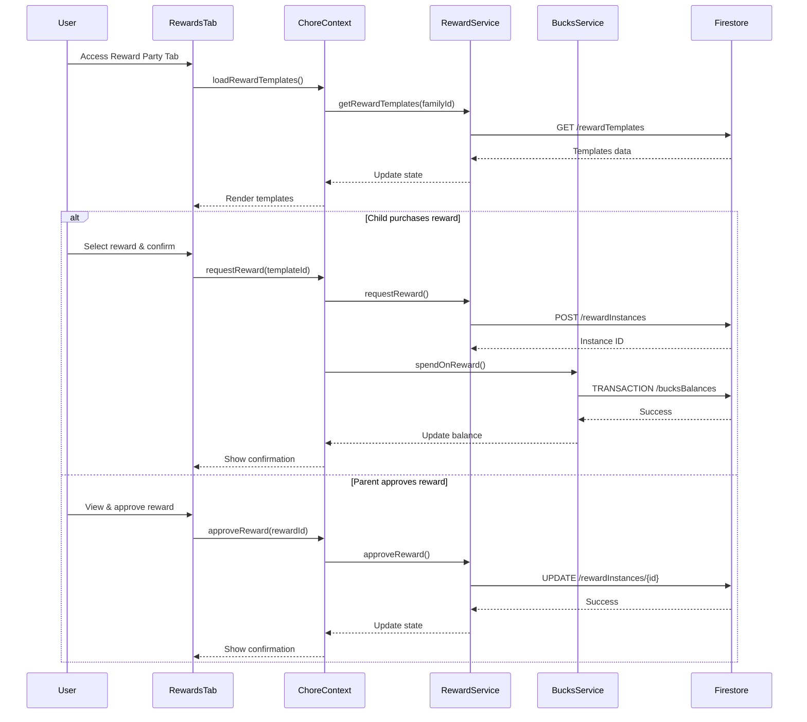

# Reward Party Tab

## What this tab is for
The Reward Party tab provides a marketplace interface where children can browse and redeem rewards using their earned Palsson Bucks. For parents, it offers oversight of reward purchases and redemption management. For children, it presents an engaging storefront of available rewards with filtering options, purchasing capability, and reward status tracking. This tab incentivizes chore completion by connecting completed tasks to meaningful rewards, teaching financial literacy through a virtual economy system.

## Key React pieces
| Component / Hook | File path | One-line responsibility |
|------------------|-----------|-------------------------|
| RewardsTab | src/components/dashboard/tabs/chore/RewardsTab.jsx | Main container for the rewards marketplace |
| ChildRewardsView | src/components/dashboard/tabs/chore/RewardsTab.jsx | Child-specific view of available rewards and purchase options |
| ParentRewardsView | src/components/dashboard/tabs/chore/RewardsTab.jsx | Parent interface for monitoring reward activity and managing approvals |
| SpotifyRewardCard | src/components/reward/SpotifyRewardCard.jsx | Visual card displaying a single reward with details and purchase option |
| BucksBalanceDisplay | src/components/bucks/BucksBalanceDisplay.jsx | Shows current Palsson Bucks balance with transaction history |
| RewardService | src/services/RewardService.js | Backend service for reward data operations |
| useChore | src/contexts/ChoreContext.js | Custom hook for accessing reward and bucks data |

## Core data & API calls
* ChoreContext provider for reward-related state management
* FamilyContext provider for family member information
* RewardService for browsing and purchasing rewards
* BucksService for currency transactions and balance management
* Firebase Firestore operations for reward templates and instances
* Firebase Storage for reward images
* Reward filtering by category and price
* Reward purchase and approval workflow
* Calendar integration for scheduled rewards

## Current Feature Flags & Env Vars
| Flag / Var | Default | Description | Doc link |
|------------|---------|-------------|----------|
| None specific to this tab | - | - | - |

## Glossary
* **Reward Template** - Purchasable item or privilege defined by parents
* **Reward Instance** - Specific purchased reward with status (pending, approved, redeemed)
* **Palsson Bucks** - Virtual currency earned from chores and used to purchase rewards
* **Reward Category** - Classification grouping similar rewards (privileges, items, activities, screen time)
* **Redemption** - Process of claiming a purchased reward in real life
* **Approval Status** - Current state of a reward purchase (pending, approved, rejected)
* **Digital Reward** - Virtual privilege that doesn't require physical delivery

## Recent changes *(auto-generated)*
```
7a7b746 Sun May 18 16:21:13 2025 +0200 Updated code
```

## Dev commands & storybook entries
* Run the app: `npm start` then navigate to the Reward Party tab
* Test reward functionality: `npm run test -- --testPathPattern=RewardsTab`
* View reward components in isolation: `npm run storybook` then navigate to Rewards section
* Storybook entries:
  * `SpotifyRewardCard.stories.jsx`
  * `RewardMarketplace.stories.jsx`
  * `RewardRedemptionFlow.stories.jsx`
* Cypress specs: `cypress/integration/rewards/reward_purchase.spec.js`

## How the entire tab works end-to-end

### User Journey
1. User navigates to Dashboard → Reward Party tab
2. If parent: Views all children's reward activities, pending approvals, and reward templates
3. If child: Sees balance display, reward marketplace with filters, and personal reward status
4. Child can browse rewards by category, purchase with Bucks, and track redemption status
5. Parent can approve/reject reward requests, fulfill rewards, and manage reward templates

### State & Data Flow
- **Context Providers**: Uses `ChoreContext` and `FamilyContext` for state management
- **Hooks**: `useChore()` provides reward-related functions and state
- **State Flow**:
  - Load: `ChoreProvider` initializes reward templates, child rewards, and approval queue
  - Purchase: Child selects reward → confirms purchase → Bucks deducted → reward instance created
  - Approval: Parent views pending rewards → approves/rejects → triggers Bucks refund if rejected
  - Redemption: Parent marks reward as fulfilled → updates reward instance status

### API Sequence
1. **Load Templates**: `GET /rewardTemplates` - Retrieves all reward templates for the family
2. **Load Child Rewards**: `GET /rewardInstances?childId={id}` - Gets child's purchased rewards
3. **Load Pending Approvals**: `GET /rewardInstances?status=pending` - Retrieves pending requests
4. **Request Reward**: `POST /rewardInstances` - Creates new reward instance with pending status
5. **Spend Bucks**: `TRANSACTION /bucksBalances/{childId}` - Deducts Bucks for purchase
6. **Approve Reward**: `UPDATE /rewardInstances/{id}` - Changes status to approved
7. **Reject Reward**: `UPDATE /rewardInstances/{id}` - Changes status to rejected
8. **Refund Bucks**: `TRANSACTION /bucksBalances/{childId}` - Refunds Bucks if rejected
9. **Fulfill Reward**: `UPDATE /rewardInstances/{id}` - Marks reward as fulfilled

### Side-effects & Cross-tab Links
- **Calendar Integration**: Creates calendar events for scheduled rewards
- **Bucks System**: Updates Bucks balance when rewards are purchased or refunded
- **Notifications**: Generates alerts for reward approvals and rejections
- **Knowledge Graph**: Records reward patterns for insights in Family Dashboard
- **Achievement System**: May trigger achievements for milestone reward redemptions

### Failure & Edge Cases
- **Insufficient Funds**: Prevents purchase if child has insufficient Bucks
- **Network Offline**: Caches purchase attempts for retry when connection restored
- **Concurrency**: Uses transactions to prevent double-spending of Bucks
- **Missing Templates**: Displays empty state with prompts to create rewards
- **Feature Flag**: Advanced reward features (scheduling, recurring) toggled by feature flags

### Mermaid Sequence Diagram


## Open TODOs / tech-debt
- [ ] Add wishlist functionality for saving desired rewards
- [ ] Implement reward preview functionality
- [ ] Add social sharing for redeemed rewards
- [ ] Improve image optimization for reward pictures
- [ ] Implement reward recommendation system based on interests