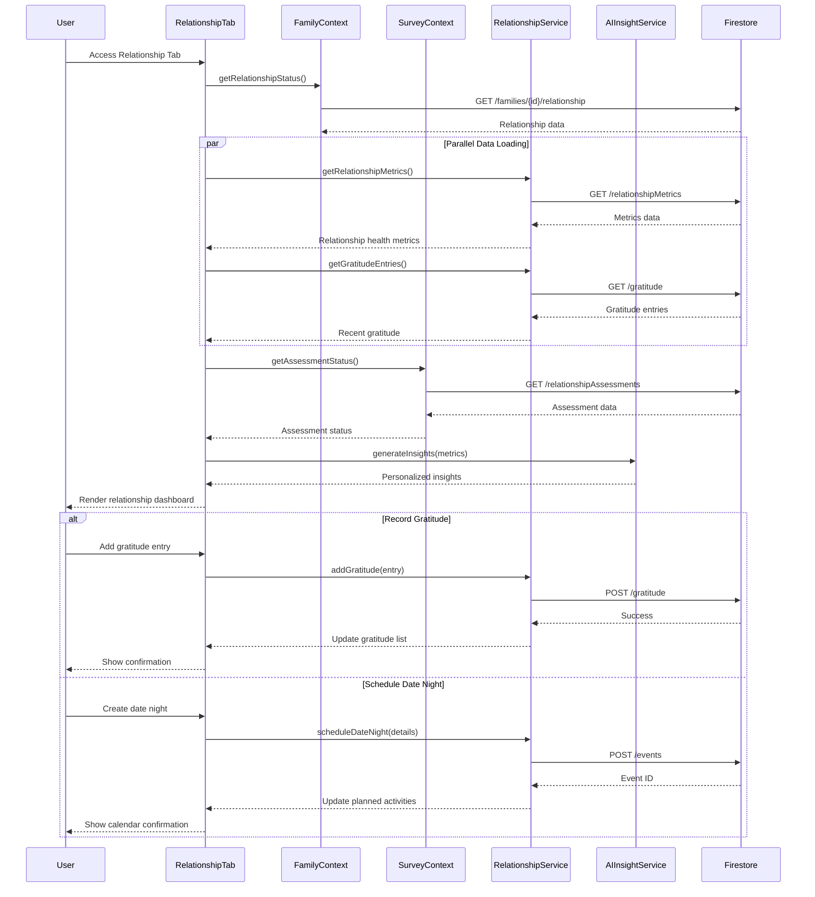

# Strong Relationship Tab

## What this tab is for
The Strong Relationship tab focuses on nurturing and strengthening the relationship between partners/parents within the family. This tab is only visible to adult family members and provides tools for relationship assessment, planning quality time together, tracking gratitude, and facilitating structured relationship check-ins. The tab combines data visualization of relationship health metrics with actionable tools to help partners communicate effectively, plan meaningful interactions, and address potential areas of concern proactively.

## Key React pieces
| Component / Hook | File path | One-line responsibility |
|------------------|-----------|-------------------------|
| RelationshipTab | src/components/dashboard/tabs/RelationshipTab.jsx | Main container orchestrating all relationship-focused components |
| CoupleRelationshipChart | src/components/dashboard/CoupleRelationshipChart.jsx | Visualizes relationship health metrics over time |
| RelationshipProgressChart | src/components/dashboard/RelationshipProgressChart.jsx | Tracks improvement in relationship quality metrics |
| DailyCheckInTool | src/components/dashboard/DailyCheckInTool.jsx | Facilitates daily communication and connection |
| DateNightPlanner | src/components/dashboard/DateNightPlanner.jsx | Helps schedule and plan quality time activities |
| GratitudeTracker | src/components/dashboard/GratitudeTracker.jsx | Records expressions of gratitude between partners |
| AIRelationshipInsights | src/components/dashboard/AIRelationshipInsights.jsx | Provides AI-generated suggestions for relationship improvement |
| RelationshipAssessment | src/components/relationship/RelationshipAssessment.jsx | Structured tool for evaluating relationship health |
| CouplesMeeting | src/components/relationship/CouplesMeeting.jsx | Facilitates structured relationship discussions |

## Core data & API calls
* FamilyContext provider for family members and relationship status
* SurveyContext provider for relationship survey responses
* Firebase Firestore operations for relationship metrics and plans
* CalendarService for scheduling relationship activities
* RelationshipCalendarIntegration for adding relationship events
* Firestore realtime listeners for relationship data updates
* Lazy loading of heavy components for performance optimization
* Relationship cycle history tracking and analysis

## Current Feature Flags & Env Vars
| Flag / Var | Default | Description | Doc link |
|------------|---------|-------------|----------|
| None specific to this tab | - | - | - |

## Glossary
* **Check-in** - Structured conversation between partners about relationship health
* **Relationship Cycle** - Time-boxed period for relationship focus and improvement
* **Gratitude** - Expression of appreciation between partners recorded for reflection
* **Insight** - AI-generated observation or suggestion about relationship dynamics
* **Date Night** - Scheduled quality time between partners for relationship nurturing
* **Love Language** - Preferred way of giving and receiving expressions of love
* **Connection Point** - Moment of meaningful interaction between partners

## Recent changes *(auto-generated)*
```
4dd61b4 Thu Apr 24 15:14:21 2025 +0200 Updated code
5c92996 Thu Apr 24 13:49:47 2025 +0200 Updated code
33516b0 Sat Apr 19 10:59:37 2025 +0200 Updated code
ac0df6d Sat Apr 19 10:30:40 2025 +0200 Updated code
2a22e51 Fri Apr 18 17:13:12 2025 +0200 Updated code
```

## Dev commands & storybook entries
* Run the app: `npm start` then navigate to the Strong Relationship tab
* Test relationship components: `npm run test -- --testPathPattern=Relationship`
* View relationship components in isolation: `npm run storybook` then navigate to Relationship section
* Storybook entries:
  * `RelationshipMetrics.stories.jsx`
  * `GratitudeTracker.stories.jsx`
  * `DateNightPlanner.stories.jsx`
  * `CouplesMeeting.stories.jsx`
* Cypress specs: `cypress/integration/relationship/relationship_tools.spec.js`

## How the entire tab works end-to-end

### User Journey
1. Partner/parent user navigates to Dashboard → Strong Relationship tab (tab only visible to adults)
2. System loads relationship data, metrics, and scheduled activities for the couple
3. Users can view relationship health visualizations showing trends over time
4. Partners can add gratitude entries, schedule date nights, and plan couple activities
5. Tab provides structured check-in tools with guided conversation prompts
6. AI-generated insights offer personalized suggestions for relationship improvement
7. Users can complete relationship assessments to identify areas needing attention

### State & Data Flow
- **Context Providers**: Uses `FamilyContext`, `SurveyContext`, and `EventContext`
- **Hooks**: `useRelationshipMetrics()` for tracking, `useSurveyAnalysis()` for insights
- **State Flow**:
  - Initial load: `RelationshipTab` fetches metrics, gratitude entries, and planned activities
  - Assessment completion: Survey answers → metrics calculation → chart visualization updates
  - Gratitude capture: Entry creation → database update → real-time UI update
  - Activity planning: Schedule creation → calendar integration → notification scheduling
  - Insights generation: Metrics analysis → AI processing → personalized suggestions

### API Sequence
1. **Load Relationship Data**: `GET /relationshipMetrics?familyId={id}` - Retrieves metrics and history
2. **Load Gratitude Entries**: `GET /gratitude?familyId={id}` - Fetches recorded gratitude notes
3. **Load Planned Activities**: `GET /events?familyId={id}&category=relationship` - Gets scheduled events
4. **Add Gratitude**: `POST /gratitude` - Records new gratitude entry
5. **Schedule Date Night**: `POST /events` - Creates calendar event for relationship activity
6. **Complete Assessment**: `POST /relationshipAssessments` - Submits assessment responses
7. **Generate Insights**: `POST /ai/relationship-insights` - Processes metrics for suggestions
8. **Update Check-in**: `UPDATE /relationshipCheckIns/{id}` - Records check-in completion

### Side-effects & Cross-tab Links
- **Calendar Integration**: Date night planning creates events in Family Calendar tab
- **Knowledge Graph**: Relationship activities strengthen connection edges in family graph
- **Dashboard Metrics**: Relationship health metrics feed into Family Dashboard visualizations
- **Notification System**: Scheduled check-ins and date nights trigger reminders
- **Habit System**: Relationship habits may appear in My Tasks tab for tracking
- **Survey System**: Assessment completions update family cycle progress

### Failure & Edge Cases
- **Privacy Controls**: Ensures relationship data is only visible to adult partners
- **Offline Support**: Caches relationship data for access without internet connection
- **Partial Assessment**: Saves progress on incomplete assessments for later completion
- **Date Scheduling Conflicts**: Detects and warns of overlapping commitments
- **Sensitive Topics**: Handles flagging of relationship issues requiring professional help
- **Single Parent Mode**: Adapts interface for single-parent families with modified tools

### Mermaid Sequence Diagram


## Open TODOs / tech-debt
- [ ] Add export functionality for relationship insights and metrics
- [ ] Improve performance of relationship charts with large datasets
- [ ] Add customization options for relationship assessment criteria
- [ ] Implement more sophisticated sentiment analysis for gratitude entries
- [ ] Add notification system for scheduled relationship activities