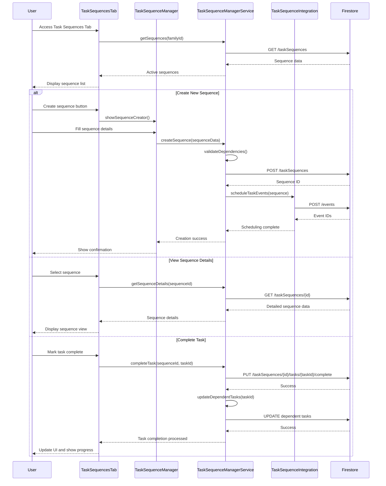

# Task Sequences Tab

## What this tab is for
The Task Sequences tab provides tools for managing complex, multi-step projects with dependent tasks and intelligent scheduling. For parents, it offers a comprehensive project management system to organize tasks with dependencies, deadlines, and automated reminders. For children, a simplified view shows their assigned tasks within family sequences. This tab helps families break down complex projects (like vacations, home renovations, or school projects) into manageable steps with clear ownership and timing.

## Key React pieces
| Component / Hook | File path | One-line responsibility |
|------------------|-----------|-------------------------|
| TaskSequencesTab | src/components/dashboard/tabs/TaskSequencesTab.jsx | Container component that holds the task sequence management interface |
| TaskSequenceManager | src/components/dashboard/task-sequence/TaskSequenceManager.jsx | Main component for listing, filtering, and administering sequences |
| TaskSequenceCreator | src/components/dashboard/task-sequence/TaskSequenceCreator.jsx | Interface for creating new task sequences with dependencies |
| TaskSequenceViewer | src/components/dashboard/task-sequence/TaskSequenceViewer.jsx | Displays and allows interaction with a single task sequence |
| TaskSequenceManagerService | src/services/TaskSequenceManager.js | Service handling backend operations for task sequences |
| TaskSequenceIntegration | src/services/TaskSequenceIntegration.js | Connects task sequences with calendar and notification systems |

## Core data & API calls
* FamilyContext provider for family member information
* AuthContext provider for current user information
* Firebase Firestore operations for task sequence CRUD operations
* TaskSequenceManagerService for business logic
* Calendar integration for scheduling sequence items
* Dependency graph calculation for task ordering
* Smart reminder generation based on task dependencies

## Current Feature Flags & Env Vars
| Flag / Var | Default | Description | Doc link |
|------------|---------|-------------|----------|
| None specific to this tab | - | - | - |

## Glossary
* **Task Sequence** - Ordered collection of tasks with dependencies between them
* **Dependency** - Relationship where one task must be completed before another can start
* **Critical Path** - Sequence of tasks that determines the minimum time needed to complete a project
* **Milestone** - Significant achievement or checkpoint within a sequence
* **Task Owner** - Family member responsible for completing a specific task
* **Lead Time** - Time between task assignment and expected start date

## Recent changes *(auto-generated)*
```
7a7b746 Sun May 18 16:21:13 2025 +0200 Updated code
```

## Dev commands & storybook entries
* Run the app: `npm start` then navigate to the Task Sequences tab
* Test sequence management: `npm run test -- --testPathPattern=TaskSequence`
* View sequence components in isolation: `npm run storybook` then navigate to TaskSequence section
* Storybook entries:
  * `TaskSequenceManager.stories.jsx`
  * `TaskSequenceViewer.stories.jsx`
  * `DependencyGraph.stories.jsx`
* Cypress specs: `cypress/integration/task_sequences/sequence_management.spec.js`

## How the entire tab works end-to-end

### User Journey
1. User navigates to Dashboard → Task Sequences tab
2. System loads active task sequences for the family and presents list/grid view
3. Parent users can create new sequences, defining tasks, dependencies, owners, and deadlines
4. Users can view sequence details, including dependency graph, critical path, and progress
5. Task owners receive notifications about upcoming tasks and can mark tasks as complete
6. Sequence progress automatically updates as tasks are completed
7. Parents can monitor all sequences while children see only their assigned tasks

### State & Data Flow
- **Context Providers**: Uses `FamilyContext` and `AuthContext` for state management
- **Hooks**: `useTaskSequence()` for sequence operations, `useCalendarIntegration()` for scheduling
- **State Flow**:
  - Initial load: `TaskSequencesTab` fetches sequence data via `TaskSequenceManagerService`
  - Sequence creation: Form data → dependency resolution → sequence validation → storage
  - Task tracking: Task status updates → dependency recalculation → sequence progress update
  - Notifications: Task due dates → reminder scheduling → notification delivery
  - Completion: Task marking as complete → dependent tasks unlocking → progress calculation

### API Sequence
1. **Load Sequences**: `GET /taskSequences?familyId={id}` - Retrieves all family task sequences
2. **Load Sequence Details**: `GET /taskSequences/{id}` - Fetches detailed data for selected sequence
3. **Create Sequence**: `POST /taskSequences` - Creates new task sequence with dependencies
4. **Update Task**: `PUT /taskSequences/{id}/tasks/{taskId}` - Updates task status or details
5. **Calculate Dependencies**: Client-side processing of dependency graph and critical path
6. **Schedule Calendar Events**: `POST /events` - Creates calendar events for tasks
7. **Schedule Notifications**: `POST /notifications` - Sets up reminders for upcoming tasks
8. **Complete Task**: `PUT /taskSequences/{id}/tasks/{taskId}/complete` - Marks task as complete
9. **Update Sequence Progress**: `PUT /taskSequences/{id}/progress` - Updates overall sequence progress

### Side-effects & Cross-tab Links
- **Calendar Integration**: Tasks create events in Family Calendar with appropriate timing
- **Notifications**: Task due dates trigger timely reminders to task owners
- **Knowledge Graph**: Sequence tasks contribute to family knowledge graph relationships
- **Activity Records**: Task completion is recorded in family activity history
- **Chore System**: Some recurring sequences may create chore templates
- **Dashboard Metrics**: Sequence completion rates feed into Family Dashboard visualizations

### Failure & Edge Cases
- **Circular Dependencies**: Detects and prevents circular task dependencies during creation
- **Task Conflicts**: Identifies scheduling conflicts between tasks assigned to same person
- **Missed Deadlines**: Provides recovery options and timeline adjustments for late tasks
- **Permission Control**: Ensures only task owners and parents can modify task statuses
- **Overdue Tasks**: Highlights blocked critical path items and suggests recovery actions
- **Sequence Templates**: Offers template library for common multi-step family projects

### Mermaid Sequence Diagram


## Open TODOs / tech-debt
- [ ] Implement drag-and-drop reordering of sequence tasks
- [ ] Add visualization of the critical path within sequences
- [ ] Improve task dependency conflict detection
- [ ] Add template library for common task sequences
- [ ] Implement resource allocation across parallel tasks